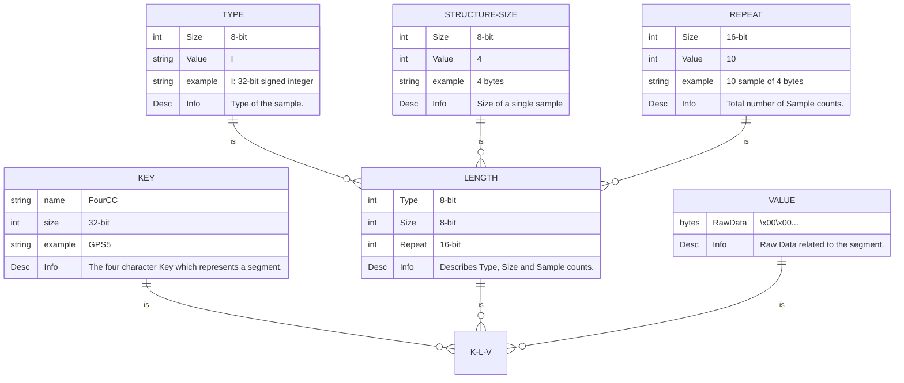
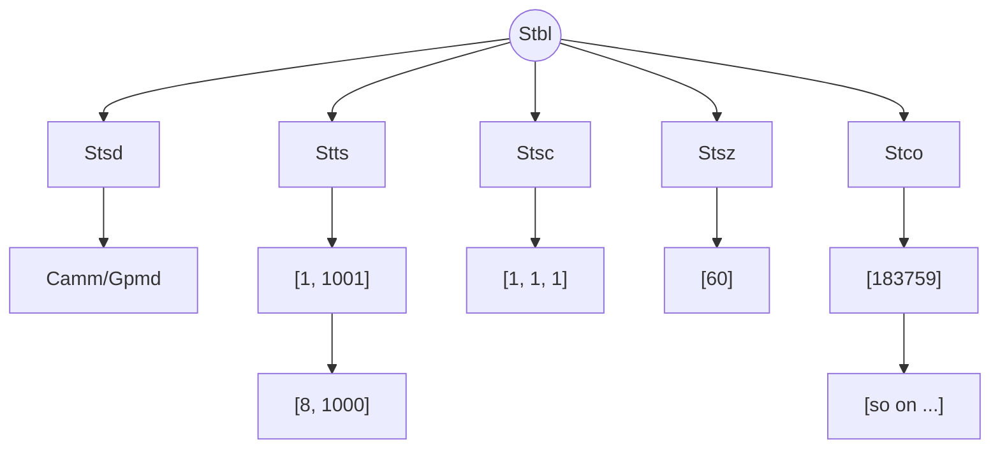
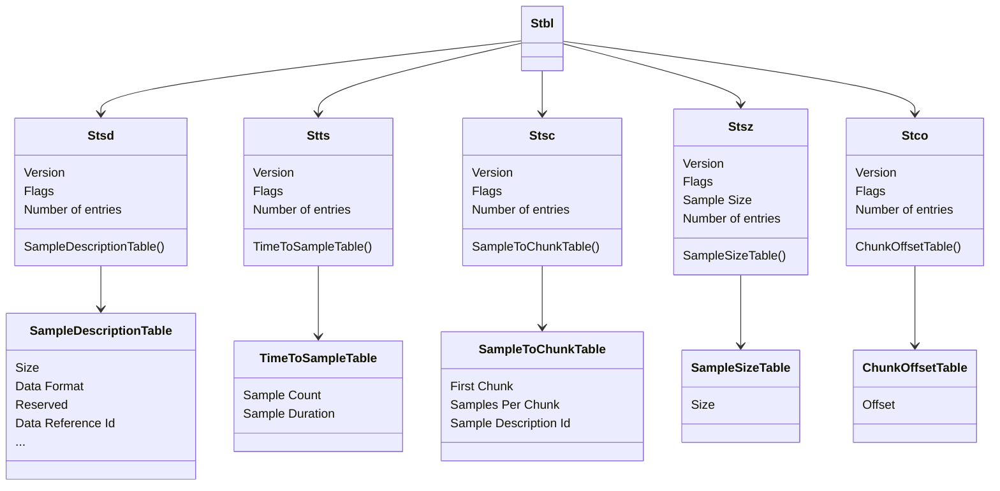
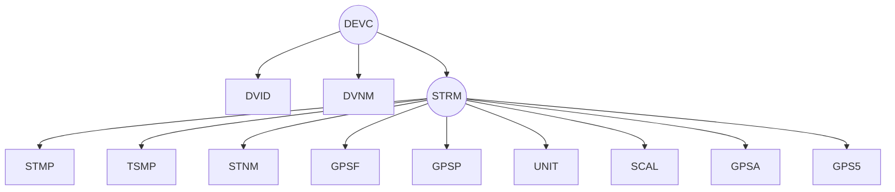

# 1. Introduction

## 1.1. KLV




## 1.2. Telemetry

### 1.2.1. Structure of video made from images

```
mpeg4 [8985739]
 ├── b'ftyp' [8, 24]
 ├── b'free' [8, 0]
 ├── b'mdat' [8, 8984749]
 └── b'moov' [8, 934]
     ├── b'mvhd' [8, 100]
     ├── b'trak' [8, 720]
     │   ├── b'tkhd' [8, 84]
     │   ├── b'edts' [8, 28]
     │   └── b'mdia' [8, 584]
     │       ├── b'mdhd' [8, 24]
     │       ├── b'hdlr' [8, 37]
     │       └── b'minf' [8, 499]
     │           ├── b'vmhd' [8, 12]
     │           ├── b'dinf' [8, 28]
     │           └── b'stbl' [8, 435]
     │               ├── b'stsd' [8, 191]
     │               │   └── b'avc1' [8, 175]
     │               ├── b'stts' [8, 16]
     │               ├── b'stss' [8, 12]
     │               ├── b'ctts' [8, 16]
     │               ├── b'stsc' [8, 20]
     │               ├── b'stsz' [8, 64]
     │               └── b'stco' [8, 60]
     └── b'udta' [8, 90]
         └── b'meta' [8, 82]
```

### 1.2.2. Adding metadata track to the video 

Below images helps to understand how data is organized in a file.


According to the size of the file, there's always a position where we can write data.


Every position represents some sort of data.


In above image we can see how the data is organised as every position holds data.

for eg.

position `(0)` holds `A`
position `(1)` holds `B`
etc...


Just like gopro has `KLVs` mp4 files has `atoms`

which starts with a `size` then `name` of the atom and afterwards the `data` related to that atom.

[https://raw.githubusercontent.com/trek-view/tools/main/images/mp4_5.png](https://raw.githubusercontent.com/trek-view/tools/main/images/mp4_6.png)


Now if we look again the structure,

There we can see the mdat size is `8984749`. so our current position to put the metadata would be `pos 8984797`.

so doing the same,

```
pos 8984797 b'DEVC\x00\x01\x01\x04DVIDL\x04\x00\x01\x00\x00\x00\x01DVNMc\t\x00\x01GoPro Max\x00\x00\x00STRM\x00\x01\x00\xdcSTMPJ\x08\x00\x01\x00\x00\x00\x00\x00\x00\x03\xe9TSMPL\x04\x00\x01\x00\x00\x00\x01STNMc+\x00\x01GPS (Lat., Long., Alt., 2D speed, 3D speed)\x00GPSFL\x04\x00\x01\x00\x00\x00\x03GPSUU\x10\x00\x01220128200000.765GPSPS\x02\x00\x01\x02\x19\x00\x00UNITc\x03\x00\x05degdegm\x00\x00m/sm/s\x00SCALl\x04\x00\x05\x00\x98\x96\x80\x00\x98\x96\x80\x00\x00\x03\xe8\x00\x00\x03\xe8\x00\x00\x03\xe8GPSAF\x04\x00\x01MSLVGPS5l\x14\x00\x01\x1e\xed\xf4\x87\x00\xab\x15Om\xbbn@\x00\x83\xfd\x10\x00\x87\xcd\xa0'
```

```
pos 8985065 b'DEVC\x00\x01\x01\x04DVIDL\x04\x00\x01\x00\x00\x00\x01DVNMc\t\x00\x01GoPro Max\x00\x00\x00STRM\x00\x01\x00\xdcSTMPJ\x08\x00\x01\x00\x00\x00\x00\x00\x00\x03\xe9TSMPL\x04\x00\x01\x00\x00\x00\x01STNMc+\x00\x01GPS (Lat., Long., Alt., 2D speed, 3D speed)\x00GPSFL\x04\x00\x01\x00\x00\x00\x03GPSUU\x10\x00\x01220128200000.965GPSPS\x02\x00\x01\x02\x19\x00\x00UNITc\x03\x00\x05degdegm\x00\x00m/sm/s\x00SCALl\x04\x00\x05\x00\x98\x96\x80\x00\x98\x96\x80\x00\x00\x03\xe8\x00\x00\x03\xe8\x00\x00\x03\xe8GPSAF\x04\x00\x01MSLVGPS5l\x14\x00\x01\x1e\xee\x1b\x97\x00\xab\x15Om\xbbn@\x00\x83\xfd\x10\x00\x87\xcd\xa0'
```

```
pos 8985333 b'DEVC\x00\x01\x01\x04DVIDL\x04\x00\x01\x00\x00\x00\x01DVNMc\t\x00\x01GoPro Max\x00\x00\x00STRM\x00\x01\x00\xdcSTMPJ\x08\x00\x01\x00\x00\x00\x00\x00\x00\x03\xe9TSMPL\x04\x00\x01\x00\x00\x00\x01STNMc+\x00\x01GPS (Lat., Long., Alt., 2D speed, 3D speed)\x00GPSFL\x04\x00\x01\x00\x00\x00\x03GPSUU\x10\x00\x01220128200001.165GPSPS\x02\x00\x01\x02\x19\x00\x00UNITc\x03\x00\x05degdegm\x00\x00m/sm/s\x00SCALl\x04\x00\x05\x00\x98\x96\x80\x00\x98\x96\x80\x00\x00\x03\xe8\x00\x00\x03\xe8\x00\x00\x03\xe8GPSAF\x04\x00\x01MSLVGPS5l\x14\x00\x01\x1e\xeeB\xa7\x00\xab\x15Om\xbbn@\x00\x83\xfd\x10\x00\x87\xcd\xa0'
```

```
pos 8985601 b'DEVC\x00\x01\x01\x04DVIDL\x04\x00\x01\x00\x00\x00\x01DVNMc\t\x00\x01GoPro Max\x00\x00\x00STRM\x00\x01\x00\xdcSTMPJ\x08\x00\x01\x00\x00\x00\x00\x00\x00\x03\xe9TSMPL\x04\x00\x01\x00\x00\x00\x01STNMc+\x00\x01GPS (Lat., Long., Alt., 2D speed, 3D speed)\x00GPSFL\x04\x00\x01\x00\x00\x00\x03GPSUU\x10\x00\x01220128200001.365GPSPS\x02\x00\x01\x02\x19\x00\x00UNITc\x03\x00\x05degdegm\x00\x00m/sm/s\x00SCALl\x04\x00\x05\x00\x98\x96\x80\x00\x98\x96\x80\x00\x00\x03\xe8\x00\x00\x03\xe8\x00\x00\x03\xe8GPSAF\x04\x00\x01MSLVGPS5l\x14\x00\x01\x1e\xeei\xb7\x00\xab\x15Om\xbbn@\x00\x83\xfd\x10\x00\x87\xcd\xa0'
```

```
pos 8985869 b'DEVC\x00\x01\x01\x04DVIDL\x04\x00\x01\x00\x00\x00\x01DVNMc\t\x00\x01GoPro Max\x00\x00\x00STRM\x00\x01\x00\xdcSTMPJ\x08\x00\x01\x00\x00\x00\x00\x00\x00\x03\xe9TSMPL\x04\x00\x01\x00\x00\x00\x01STNMc+\x00\x01GPS (Lat., Long., Alt., 2D speed, 3D speed)\x00GPSFL\x04\x00\x01\x00\x00\x00\x03GPSUU\x10\x00\x01220128200001.565GPSPS\x02\x00\x01\x02\x19\x00\x00UNITc\x03\x00\x05degdegm\x00\x00m/sm/s\x00SCALl\x04\x00\x05\x00\x98\x96\x80\x00\x98\x96\x80\x00\x00\x03\xe8\x00\x00\x03\xe8\x00\x00\x03\xe8GPSAF\x04\x00\x01MSLVGPS5l\x14\x00\x01\x1e\xee\x90\xc7\x00\xab\x15Om\xbbn@\x00\x83\xfd\x10\x00\x87\xcd\xa0'
```

```
pos 8986137 b'DEVC\x00\x01\x01\x04DVIDL\x04\x00\x01\x00\x00\x00\x01DVNMc\t\x00\x01GoPro Max\x00\x00\x00STRM\x00\x01\x00\xdcSTMPJ\x08\x00\x01\x00\x00\x00\x00\x00\x00\x03\xe9TSMPL\x04\x00\x01\x00\x00\x00\x01STNMc+\x00\x01GPS (Lat., Long., Alt., 2D speed, 3D speed)\x00GPSFL\x04\x00\x01\x00\x00\x00\x03GPSUU\x10\x00\x01220128200001.765GPSPS\x02\x00\x01\x02\x19\x00\x00UNITc\x03\x00\x05degdegm\x00\x00m/sm/s\x00SCALl\x04\x00\x05\x00\x98\x96\x80\x00\x98\x96\x80\x00\x00\x03\xe8\x00\x00\x03\xe8\x00\x00\x03\xe8GPSAF\x04\x00\x01MSLVGPS5l\x14\x00\x01\x1e\xee\xb7\xd7\x00\xab\x15Om\xbbn@\x00\x83\xfd\x10\x00\x87\xcd\xa0'
```

```
pos 8986405 b'DEVC\x00\x01\x01\x04DVIDL\x04\x00\x01\x00\x00\x00\x01DVNMc\t\x00\x01GoPro Max\x00\x00\x00STRM\x00\x01\x00\xdcSTMPJ\x08\x00\x01\x00\x00\x00\x00\x00\x00\x03\xe9TSMPL\x04\x00\x01\x00\x00\x00\x01STNMc+\x00\x01GPS (Lat., Long., Alt., 2D speed, 3D speed)\x00GPSFL\x04\x00\x01\x00\x00\x00\x03GPSUU\x10\x00\x01220128200001.965GPSPS\x02\x00\x01\x02\x19\x00\x00UNITc\x03\x00\x05degdegm\x00\x00m/sm/s\x00SCALl\x04\x00\x05\x00\x98\x96\x80\x00\x98\x96\x80\x00\x00\x03\xe8\x00\x00\x03\xe8\x00\x00\x03\xe8GPSAF\x04\x00\x01MSLVGPS5l\x14\x00\x01\x1e\xee\xde\xe7\x00\xab\x15Om\xbbn@\x00\x83\xfd\x10\x00\x87\xcd\xa0'
```

```
pos 8986673 b'DEVC\x00\x01\x01\x04DVIDL\x04\x00\x01\x00\x00\x00\x01DVNMc\t\x00\x01GoPro Max\x00\x00\x00STRM\x00\x01\x00\xdcSTMPJ\x08\x00\x01\x00\x00\x00\x00\x00\x00\x03\xe9TSMPL\x04\x00\x01\x00\x00\x00\x01STNMc+\x00\x01GPS (Lat., Long., Alt., 2D speed, 3D speed)\x00GPSFL\x04\x00\x01\x00\x00\x00\x03GPSUU\x10\x00\x01220128200002.165GPSPS\x02\x00\x01\x02\x19\x00\x00UNITc\x03\x00\x05degdegm\x00\x00m/sm/s\x00SCALl\x04\x00\x05\x00\x98\x96\x80\x00\x98\x96\x80\x00\x00\x03\xe8\x00\x00\x03\xe8\x00\x00\x03\xe8GPSAF\x04\x00\x01MSLVGPS5l\x14\x00\x01\x1e\xef\x05\xf7\x00\xab\x15Om\xbbn@\x00\x83\xfd\x10\x00\x87\xcd\xa0'
```

```
pos 8986941 b'DEVC\x00\x01\x01\x04DVIDL\x04\x00\x01\x00\x00\x00\x01DVNMc\t\x00\x01GoPro Max\x00\x00\x00STRM\x00\x01\x00\xdcSTMPJ\x08\x00\x01\x00\x00\x00\x00\x00\x00\x03\xe9TSMPL\x04\x00\x01\x00\x00\x00\x01STNMc+\x00\x01GPS (Lat., Long., Alt., 2D speed, 3D speed)\x00GPSFL\x04\x00\x01\x00\x00\x00\x03GPSUU\x10\x00\x01220128200002.365GPSPS\x02\x00\x01\x02\x19\x00\x00UNITc\x03\x00\x05degdegm\x00\x00m/sm/s\x00SCALl\x04\x00\x05\x00\x98\x96\x80\x00\x98\x96\x80\x00\x00\x03\xe8\x00\x00\x03\xe8\x00\x00\x03\xe8GPSAF\x04\x00\x01MSLVGPS5l\x14\x00\x01\x1e\xef-\x07\x00\xab\x15Om\xbbn@\x00\x83\xfd\x10\x00\x87\xcd\xa0'
```

```
pos 8987209 b'DEVC\x00\x01\x01\x04DVIDL\x04\x00\x01\x00\x00\x00\x01DVNMc\t\x00\x01GoPro Max\x00\x00\x00STRM\x00\x01\x00\xdcSTMPJ\x08\x00\x01\x00\x00\x00\x00\x00\x00\x03\xe9TSMPL\x04\x00\x01\x00\x00\x00\x01STNMc+\x00\x01GPS (Lat., Long., Alt., 2D speed, 3D speed)\x00GPSFL\x04\x00\x01\x00\x00\x00\x03GPSUU\x10\x00\x01220128200002.565GPSPS\x02\x00\x01\x02\x19\x00\x00UNITc\x03\x00\x05degdegm\x00\x00m/sm/s\x00SCALl\x04\x00\x05\x00\x98\x96\x80\x00\x98\x96\x80\x00\x00\x03\xe8\x00\x00\x03\xe8\x00\x00\x03\xe8GPSAF\x04\x00\x01MSLVGPS5l\x14\x00\x01\x1e\xef-\x07\x00\xab\x15Om\xbbn@\x00\x83\xfd\x10\x00\x87\xcd\xa0'
```

```
pos 8987477 b'DEVC\x00\x01\x01\x04DVIDL\x04\x00\x01\x00\x00\x00\x01DVNMc\t\x00\x01GoPro Max\x00\x00\x00STRM\x00\x01\x00\xdcSTMPJ\x08\x00\x01\x00\x00\x00\x00\x00\x00\x03\xe9TSMPL\x04\x00\x01\x00\x00\x00\x01STNMc+\x00\x01GPS (Lat., Long., Alt., 2D speed, 3D speed)\x00GPSFL\x04\x00\x01\x00\x00\x00\x03GPSUU\x10\x00\x01220128200002.765GPSPS\x02\x00\x01\x02\x19\x00\x00UNITc\x03\x00\x05degdegm\x00\x00m/sm/s\x00SCALl\x04\x00\x05\x00\x98\x96\x80\x00\x98\x96\x80\x00\x00\x03\xe8\x00\x00\x03\xe8\x00\x00\x03\xe8GPSAF\x04\x00\x01MSLVGPS5l\x14\x00\x01\x1e\xef0\xef\x00\xab\x15Om\xbbn@\x00\x83\xfd\x10\x00\x87\xcd\xa0'
```

```
pos 8987745 b'DEVC\x00\x01\x01\x04DVIDL\x04\x00\x01\x00\x00\x00\x01DVNMc\t\x00\x01GoPro Max\x00\x00\x00STRM\x00\x01\x00\xdcSTMPJ\x08\x00\x01\x00\x00\x00\x00\x00\x00\x03\xe9TSMPL\x04\x00\x01\x00\x00\x00\x01STNMc+\x00\x01GPS (Lat., Long., Alt., 2D speed, 3D speed)\x00GPSFL\x04\x00\x01\x00\x00\x00\x03GPSUU\x10\x00\x01220128200002.965GPSPS\x02\x00\x01\x02\x19\x00\x00UNITc\x03\x00\x05degdegm\x00\x00m/sm/s\x00SCALl\x04\x00\x05\x00\x98\x96\x80\x00\x98\x96\x80\x00\x00\x03\xe8\x00\x00\x03\xe8\x00\x00\x03\xe8GPSAF\x04\x00\x01MSLVGPS5l\x14\x00\x01\x1e\xef4\xd7\x00\xab\x15Om\xbbn@\x00\x83\xfd\x10\x00\x87\xcd\xa0'
```

```
pos 8988013 b'DEVC\x00\x01\x01\x04DVIDL\x04\x00\x01\x00\x00\x00\x01DVNMc\t\x00\x01GoPro Max\x00\x00\x00STRM\x00\x01\x00\xdcSTMPJ\x08\x00\x01\x00\x00\x00\x00\x00\x00\x03\xe9TSMPL\x04\x00\x01\x00\x00\x00\x01STNMc+\x00\x01GPS (Lat., Long., Alt., 2D speed, 3D speed)\x00GPSFL\x04\x00\x01\x00\x00\x00\x03GPSUU\x10\x00\x01220128200003.165GPSPS\x02\x00\x01\x02\x19\x00\x00UNITc\x03\x00\x05degdegm\x00\x00m/sm/s\x00SCALl\x04\x00\x05\x00\x98\x96\x80\x00\x98\x96\x80\x00\x00\x03\xe8\x00\x00\x03\xe8\x00\x00\x03\xe8GPSAF\x04\x00\x01MSLVGPS5l\x14\x00\x01\x1e\xef8\xbf\x00\xab\x15Om\xbbn@\x00\x83\xfd\x10\x00\x87\xcd\xa0'
```

And `mdat` will appear something like below images:


### 1.2.3. Resulting video

and the resulting output of the video structure will look like this:

```
mpeg4 [8990398]
 ├── b'ftyp' [8, 24]
 ├── b'free' [8, 0]
 ├── b'mdat' [8, 8988233]
 └── b'moov' [8, 2109]
     ├── b'mvhd' [8, 100]
     ├── b'trak' [8, 1174]
     │   ├── b'tkhd' [8, 84]
     │   ├── b'edts' [8, 28]
     │   ├── b'mdia' [8, 584]
     │   │   ├── b'mdhd' [8, 24]
     │   │   ├── b'hdlr' [8, 37]
     │   │   └── b'minf' [8, 499]
     │   │       ├── b'vmhd' [8, 12]
     │   │       ├── b'dinf' [8, 28]
     │   │       └── b'stbl' [8, 435]
     │   │           ├── b'stsd' [8, 191]
     │   │           │   └── b'avc1' [8, 175]
     │   │           ├── b'stts' [8, 16]
     │   │           ├── b'stss' [8, 12]
     │   │           ├── b'ctts' [8, 16]
     │   │           ├── b'stsc' [8, 20]
     │   │           ├── b'stsz' [8, 64]
     │   │           └── b'stco' [8, 60]
     │   └── b'uuid' [8, 446]
     ├── b'udta' [8, 90]
     │   └── b'meta' [8, 82]
     └── b'trak' [8, 713]
         ├── b'tkhd' [8, 84]
         └── b'mdia' [8, 613]
             ├── b'mdhd' [8, 24]
             ├── b'hdlr' [8, 37]
             └── b'minf' [8, 528]
                 ├── b'gmhd' [8, 36]
                 └── b'stbl' [8, 476]
                     ├── b'stsd' [8, 28]
                     │   └── b'gpmd' [8, 12]
                     ├── b'stts' [8, 120]
                     ├── b'stsc' [8, 164]
                     ├── b'stsz' [8, 64]
                     └── b'stco' [8, 60]
```

We can see a new track in the structure.



### 1.2.4. mp4 atoms



### 1.2.5. Understanding Metadata

Now if we dug into the metadata we can get a bit of info:

### 1.2.4.1. Metadata Structure

```
DEVC\x00\x01\x01\x04
    DVIDL\x04\x00\x01\x00\x00\x00\x01
    DVNMc\t\x00\x01GoPro Max\x00\x00\x00
    STRM\x00\x01\x00\xdc
        STMPJ\x08\x00\x01\x00\x00\x00\x00\x00\x00\x03\xe9
        TSMPL\x04\x00\x01\x00\x00\x00\x01
        STNMc+\x00\x01GPS (Lat., Long., Alt., 2D speed, 3D speed)\x00
        GPSFL\x04\x00\x01\x00\x00\x00\x03GPSUU\x10\x00\x01220128200003.165
        GPSPS\x02\x00\x01\x02\x19\x00\x00
        UNITc\x03\x00\x05degdegm\x00\x00m/sm/s\x00
        SCALl\x04\x00\x05\x00\x98\x96\x80\x00\x98\x96\x80\x00\x00\x03\xe8\x00\x00\x03\xe8\x00\x00\x03\xe8
        GPSAF\x04\x00\x01MSLV
        GPS5l\x14\x00\x01\x1e\xef8\xbf\x00\xab\x15Om\xbbn@\x00\x83\xfd\x10\x00\x87\xcd\xa0
```



### 1.2.4.2. DEVC

To Describe the above data, let go step by step according to `KLV` structure:
`KLV` is FourCC--Length--Value
Here, 
```
\x00\x01\x01\x04
```
- FourCC: `DEVC` is Four character key.
- Type: `\x00` is `0` and `0` means that this segment is a container. (all of the types are described here: [https://github.com/gopro/gpmf-parser#type](https://github.com/gopro/gpmf-parser#type))
- Length: length is `\x01`, `1` and the type is a character so `DEVC` is a container and 
- Repeat: is `260`. How? we have `b'\x01\x04'` as repeat and if we unpack it we will get the length as 260.
```python
struct.unpack('>H', z[2:])[0]
260
```

and we can  double check the length by running the length function:

and the rest of the data is the `DEVC` value.

```python
len('DVIDL\x04\x00\x01\x00\x00\x00\x01DVNMc\t\x00\x01GoPro Max\x00\x00\x00STRM\x00\x01\x00\xdcSTMPJ\x08\x00\x01\x00\x00\x00\x00\x00\x00\x03\xe9TSMPL\x04\x00\x01\x00\x00\x00\x01STNMc+\x00\x01GPS (Lat., Long., Alt., 2D speed, 3D speed)\x00GPSFL\x04\x00\x01\x00\x00\x00\x03GPSUU\x10\x00\x01220128200003.165GPSPS\x02\x00\x01\x02\x19\x00\x00UNITc\x03\x00\x05degdegm\x00\x00m/sm/s\x00SCALl\x04\x00\x05\x00\x98\x96\x80\x00\x98\x96\x80\x00\x00\x03\xe8\x00\x00\x03\xe8\x00\x00\x03\xe8GPSAF\x04\x00\x01MSLVGPS5l\x14\x00\x01\x1e\xef8\xbf\x00\xab\x15Om\xbbn@\x00\x83\xfd\x10\x00\x87\xcd\xa0')
260
```

### 1.2.4.2.1. DVID

Auto generated unique-ID for managing a large number of connect devices, camera, karma and external BLE devices

```
DVIDL\x04\x00\x01\x00\x00\x00\x01
```

- FourCC: `DVID` is Four character key.
- Type: `L` is 32-bit unsigned integer
- Length: length is `\x04`, `4` and the type is not a container instead segment. 
- Repeat: is `1`. How? we have `b'\x00\x01'` as repeat and if we unpack it we will get the length as 1.
```python
struct.unpack('>H', z[6:8])[0]
1
```
That means there is a 4 bytes data for `DVID` which we can unpack like:
b`\x00\x00\x00\x01`
```
struct.unpack('>I', b`\x00\x00\x00\x01`)
```

meaning DVID is `1`.

### 1.2.4.2.2. DVNM

Display name of the device like "GoPro Max", this is for communicating to the user the data recorded, so it should be informative.

```
DVNMc\t\x00\x01GoPro Max\x00\x00\x00
```

- FourCC: `DVNM` is Four character key.
- Type: `c` is character
- Length: length is `\t`, `9` and the type is not a container so it is a segment. 
```
struct.unpack('>b', b'\t')[0]
9
```
- Repeat: is `1`. How? we have `b'\x00\x01'` as repeat and if we unpack it we will get the length as 1.

But If you look closely here is one thing to consider.

The `Length` should be represantative of the type `Type` and each sample is limited to 255 bytes or less.

so `9` length is alright but more proper way to use would be `Length: 1` and `Repeat: 9`

so above data will now look like:

```
DVNMc\x01\x00\tGoPro Max
```

check before the `Length` was `\t` but now it is `\x01` which equates to `1`.
and `Repeat` was `\x00\x01` and is now `\x00\t` which equates to `9`.

but now your question would be - "Why total length of the data is `12` but the data length in `Length`*`Repeat` = 9"?
```
GoPro Max\x00\x00\x00
```
To answer that question, Please see the `KLV` image above you can see that the raw data is 32-bit aligned meaning if the data is not 32-bit aligned then we pad `\x00` zeroes at the end to make the raw data 32-bit aligned. Hence you can see the 3 zeroes at the end of the data making the size `9+3` = `12`.

- `9` = Usual data
- `3` = `\x00\x00\x00` zeroes
- total length = 12

Hence the `DVNM` Device Name for the device to capture the images is `GoPro Max` camera.

### 1.2.4.2.3. STRM

Each metadata Device can have multiple streams on sensor data, e.g. Camera Device could have GPS, Accelerometer and Gyro streams

Metadata streams are each nested with STRM

```
STRM\x00\x01\x00\xdc
```

- FourCC: `STRM` is Four character key.
- Type: `\x00` is `0` and `0` means that this segment is a container.
- Length: length is `\x01`, `1`.
- Repeat: is `220`. How? we have `b'\x00\xdc'` as repeat and if we unpack it we will get the length as 220.

```python
struct.unpack('>H', b'\x00\xdc')[0]
220
```

```
    STRM\x00\x01\x00\xdc
        STMPJ\x08\x00\x01\x00\x00\x00\x00\x00\x00\x03\xe9
        TSMPL\x04\x00\x01\x00\x00\x00\x01
        STNMc+\x00\x01GPS (Lat., Long., Alt., 2D speed, 3D speed)\x00
        GPSFL\x04\x00\x01\x00\x00\x00\x03GPSUU\x10\x00\x01220128200003.165
        GPSPS\x02\x00\x01\x02\x19\x00\x00
        UNITc\x03\x00\x05degdegm\x00\x00m/sm/s\x00
        SCALl\x04\x00\x05\x00\x98\x96\x80\x00\x98\x96\x80\x00\x00\x03\xe8\x00\x00\x03\xe8\x00\x00\x03\xe8
        GPSAF\x04\x00\x01MSLV
        GPS5l\x14\x00\x01\x1e\xef8\xbf\x00\xab\x15Om\xbbn@\x00\x83\xfd\x10\x00\x87\xcd\xa0
```

### 1.2.4.2.3.1. STMP

```
STMPJ\x08\x00\x01\x00\x00\x00\x00\x00\x00\x03\xe9
```

Microsecond timestampes

- FourCC: `STMP` is Four character key.
- Type: `J` is 64-bit unsigned unsigned number.
- Length: length is `\x08`, `8`.
- Repeat: is `1`.
- Data:
```python
struct.unpack('>Q', b'\x00\x00\x00\x00\x00\x00\x03\xe9')[0]
1001
```

#### 1.2.4.2.3.2. TSMP

```
TSMPL\x04\x00\x01\x00\x00\x00\x01
```

- FourCC: `TSMP` is Four character key.
- Type: `L` is 32-bit unsigned integer.
- Length: length is `\x04`, `4`.
- Repeat: is `1`.
- Data:
```python
struct.unpack('>I', b'\x00\x00\x00\x01')[0]
1
```

#### 1.2.4.2.3.3. STNM

```
STNMc+\x00\x01GPS (Lat., Long., Alt., 2D speed, 3D speed)\x00
```

- FourCC: `STNM` is Four character key.
- Type: `c` is single byte 'c' style ASCII character string.
- Length: length is `+`, `43`.
```python
struct.unpack('>b', b'+')[0]
```
- Repeat: is `1`.
- Data:
```
GPS (Lat., Long., Alt., 2D speed, 3D speed)
```

#### 1.2.4.2.3.4. GPSF

```
GPSFL\x04\x00\x01\x00\x00\x00\x03
```

- FourCC: `GPSF` is Four character key.
- Type: `L` is 32-bit unsigned integer.
- Length: length is `\x04`, `4`.
- Repeat: is `1`.
- Data:
```python
struct.unpack('>I', b'\x00\x00\x00\x03')[0]
3
```

#### 1.2.4.2.3.4. GPSU

```
GPSUU\x10\x00\x01220128200003.165
```

- FourCC: `GPSU` is Four character key.
- Type: `U` is UTC Date and Time string.
- Length: length is `\x10`, `10`.
- Repeat: is `1`.
- Data:
```python
20128200003.165
```

#### 1.2.4.2.3.5. GPSP

```
GPSPS\x02\x00\x01\x02\x19\x00\x00
```

- FourCC: `GPSP` is Four character key.
- Type: `S` is 16-bit unsigned integer.
- Length: length is `\x02`, `2`.
- Repeat: is `1`.
- Data:
```python
struct.unpack('>H', b'\x02\x19')[0]
537
```

#### 1.2.4.2.3.6. UNIT

```
UNITc\x03\x00\x05degdegm\x00\x00m/sm/s\x00
```

- FourCC: `UNIT` is Four character key.
- Type: `c` is single byte 'c' style ASCII character string.
- Length: length is `\x03`, `3`.
- Repeat: is `5`.
- Data:
```
deg
deg
m
m/s
m/s
```

#### 1.2.4.2.3.7. SCAL

```
SCALl\x04\x00\x05
b'\x00\x98\x96\x80'
b'\x00\x98\x96\x80'
b'\x00\x00\x03\xe8'
b'\x00\x00\x03\xe8'
b'\x00\x00\x00d'
```

- FourCC: `SCAL` is Four character key.
- Type: `L` is 32-bit unsigned integer.
- Length: length is `\x04`, `4`.
- Repeat: is `5`.
- Data:

```python
struct.unpack('>I', b'\x00\x98\x96\x80')[0]
10000000
struct.unpack('>I', b'\x00\x98\x96\x80')[0]
10000000
struct.unpack('>I', b'\x00\x00\x03\xe8')[0]
1000
struct.unpack('>I', b'\x00\x00\x03\xe8')[0]
1000
struct.unpack('>I', b'\x00\x00\x00d')[0]
100
```

#### 1.2.4.2.3.8. GPSA

```
GPSAF\x04\x00\x01MSLV
```

- FourCC: `GPSA` is Four character key.
- Type: `F` is 32-bit four character key -- FourCC.
- Length: length is `\x04`, `4`.
- Repeat: is `1`.
- Data:
```
MSLV
```

#### 1.2.4.2.3.9. GPS5

```
GPS5l\x14\x00\x01
b'\x1e\xef8\xbf'
b'\x00\xab\x15O'
b'\x00\x02\xcf$'
b'\x00\x00\x03a'
b'\x00\x00\x00Y'
```

- FourCC: `GPS5` is Four character key.
- Type: `l` is 32-bit signed integer.
- Length: length is `\x14`, `14`.
- Repeat: is `1`.
- Data:

```python
struct.unpack('>I', b'\x1e\xef8\xbf')[0]
518994111
struct.unpack('>I', b'\x00\xab\x15O')[0]
11212111
struct.unpack('>I', b'x00\x02\xcf$')[0]
184100
struct.unpack('>I', b'\x00\x00\x03a')[0]
865
struct.unpack('>I', b'\x00\x00\x00Y')[0]
89
```

Here we can use `SCAL` values with these values to get the exact values.

```python
518994111/10000000 = 51.8994111
```

```python
11212111/10000000 = 1.1212111
```

```python
184100/1000 = 184.1
```

```python
865/1000 = 0.865
```

```python
89/100 = 0.89
```

# 1.2. Real World Example

Lets start with an actual gopro video for better understanding.

For this example we will use `GS028542.MP4` video.

lets run the below command to get the raw metadata from the video:

```shell
git clone https://github.com/trek-view/tools
cd telemetry-injector
python print_video_atoms_detail.py ./GS028542.MP4 > output.txt
```
after running this command we will get the raw metadata along with additional info inside the `output.txt` file.

Now open the `output.txt` file in a text editor.

`output.txt` should generally output large amount of data so let go step by step:

Metadata will look something like this:

```
b'
DEVC\x00\x01)\xf4
DVIDL\x04\x00\x01\x00\x00\x00\x01
DVNMc\t\x00\x01GoPro Max\x00\x00\x00

STRM\x00\x01\x05\\
	STMPJ\x08\x00\x01\x00\x00\x00\x00\x1c\xc4\xc4\x19
	TSMPL\x04\x00\x01\x00\x01z\xe8
	STNMc\r\x00\x01Accelerometer\x00\x00\x00
	MTRXf$\x00\x01\x00\x00\x00\x00\xbf\x80\x00\x00\x00\x00\x00\x00?\x80\x00\x00\x00\x00\x00\x00\x00\x00\x00\x00\x00\x00\x00\x00\x00\x00\x00\x00?\x80\x00\x00
	ORINc\x03\x00\x01XzY\x00
	ORIOc\x03\x00\x01ZXY\x00
	SIUNc\x04\x00\x01m/s\xb2
	SCALs\x02\x00\x01\x01\xa1\x00\x00
	TMPCf\x04\x00\x01A\xfd\x84\x00
	ACCLs\x06\x00\xc9\xfa\xf0\xf5\xd4\x01u\xfa\x7f\xf5\xcf\x01\xf8\xf9\xf5\xf5\x8b\x02\xc2\xf9\x96\xf5c\x03\xd9\xf9\xbd\xf5r\x04\x85\xf9\xc1\xf5E\x05\'\xf9Y\xf4\xbe\x05\xa8\xf9\x83\xf4R\x05\xa9\xf9\xcb\xf4\x14\x05\xdf\xfa\x1c\xf3\xb0\x06[\xfaT\xf3H\x06\xc5\xfay\xf2\xa1\x06\x95\xfa\xe5\xf2S\x06J\xfbA\xf2\x1d\x068\xfb\xdf\xf1\xcc\x06\x16\xfc\x81\xf1B\x06\x07\xfd\x0e\xf0\xc5\x05\xd9\xfd\xe7\xf0S\x05,\xfey\xef\xa1\x03\xd5\xfe\xe7\xee\xba\x02\x9a\xff\x81\xed\xf1\x01\xc0\xff\xd7\xed!\x01\x1d\x00\r\xec\xad\x00\x98\x00J\xec\x88\xff\xd1\x00\x89\xec\xa1\xff\xb5\x00\x96\xec\xed\xff\x89\x00\x8d\xed\x80\xff\xac\x00r\xee\x00\xff\xf8\x00Q\xee\x8e\x00s\x00t\xef\x1d\x01@\x00=\xef\x0c\x01\xf6\xff\xdd\xee@\x02\x88\xff\xbb\xec\xde\x03o\xff\x89\xeaH\x03|\xff\xc8\xe7T\x02O\xff\x83\xe3\xff\xff\xad\x00\x92\xe1\x9b\xfd\xa1\x01\x82\xdf\xcd\xfc\xcf\x01\xcf\xde\x12\xf9\xc4\x02\x9c\xdd\xe0\xf7\xfd\x03^\xdf\x93\xf7>\x03\x88\xe1\xdf\xf5\xcb\x04\xf2\xe5\x15\xf4J\x06\x05\xe82\xf3l\x05\xa2\xea\xef\xf3\xf8\x04\xe8\xec\x98\xf4\x95\x04?\xed\xa7\xf4\x99\x03\xc0\xee]\xf4\xc4\x034\xee[\xf4\x99\x02g\xed\xd6\xf4~\x01\x05\xed\x18\xf5x\xff\xab\xecs\xf6\xba\xfe;\xeb\x87\xf7\xf3\xfc}\xea\xe6\xf9j\xfa\xe0\xeaR\xfa\xf6\xf9X\xe9\xf1\xfc\xaa\xf7\xec\xe9\xf5\xff\x1f\xf6_\xe9\xd6\x02\x04\xf5\xae\xe9\xea\x03\xf8\xf5E\xea!\x06q\xf57\xea\xa6\t\xdf\xf5s\xea\xf6\x0b\x99\xf5\xfd\xea\xf5\x0b\x99\xf6\xe1\xea\xe5\x0bn\xf8g\xeb\x91\r^\xf9\x98\xec@\x0f\'\xfaQ\xec\xbe\x0f\x85\xfa\xdc\xed\x17\x0f\x19\xfb\xb3\xedU\x0e^\xfdq\xeeK\x0eN\xfe\x17\xee\xc8\x0e,\xfe\xce\xef`\r1\xff\n\xef\x9d\x0b\x84\x00\x1a\xf0\x86\nG\x00\xab\xf16\t1\x01*\xf1\x9d\x07-\x01h\xf1\xde\x04\xcd\x01\xce\xf2K\x03Q\x023\xf2\xc8\x01\xb8\x02\x17\xf3r\x00D\x02\x89\xf3\xdb\xfd\x94\x03*\xf4;\xfb<\x03\x1f\xf4\x90\xf9\xc3\x02\xdc\xf4\xea\xf9S\x02\xca\xf5*\xf8\x15\x02\xf0\xf5\x8a\xf72\x03\x01\xf5\xf7\xf6\x9b\x03\x06\xf6?\xf5\xb4\x02\x8b\xf5\xe3\xf4\x86\x02\x18\xf6\xed\xf4\xe0\x011\xf7\x15\xf57\x00\xed\xf7%\xf4:\x00\x96\xf7c\xf4\x0c\x00"\xf7\xbf\xf48\x00\x06\xf85\xf4Y\xffT\xf88\xf4\xc9\xfe\x9e\xf8@\xf4\xca\xfeF\xf8\xa3\xf5y\xfd\xd2\xf8\xd1\xf5\xe6\xfdw\xf8\xea\xf6\x9c\xfc\xc4\xf8\xeb\xf7r\xfc#\xf8\xf9\xf8[\xfb\xca\xf8\xeb\xf9A\xfb\xcc\xf9\x15\xfa\x12\xfb\x81\xf9\x1a\xfb\x1e\xfa\xd2\xf8\xf6\xfc\x94\xfa\xa5\xf8\xff\xfd|\xfa\xaf\xf8\xe2\xfe`\xfa\x9e\xf8\xd6\x00B\xfa\xa8\xf8\x9d\x00\xeb\xfb)\xf8x\x02\x05\xfbr\xf8O\x03]\xfb\x8c\xf83\x04W\xfb\x9f\xf7\xc9\x06\x1c\xfb\xaf\xf7\x81\x07\x15\xfc\x15\xf7<\x06\x90\xfc\xa0\xf6\xcb\x07m\xfc\xa2\xf6\x17\x07\xe1\xfc\x8d\xf5\x91\x08\xcb\xfc\xc7\xf4\xd7\t\xfd\xfdz\xf4G\n\xac\xfd\x8d\xf37\n\xaf\xfd\xb9\xf2T\x0b\x1c\xfe\x0c\xf1\xa8\x0c \xfd\xe9\xf0\xd0\x0cO\xfd\xd5\xf0H\rL\xfd\xf7\xf0\x10\r\xba\xfe\x0e\xef\xad\rn\xfd\xe7\xefG\ru\xfd\x91\xef!\r\xef\xfd \xee\xcd\r\xc6\xfd\x13\xee\x9d\r\xba\xfd\x18\xee\xb1\rr\xfc\xc4\xee\x9a\x0c\x99\xfcN\xee\x97\x0b\xa2\xfb\xf4\xee\xff\x0bU\xfb\xb7\xefx\x0b4\xfb\xc2\xf0\n\n<\xfb\x04\xf0T\t\x97\xfa\x82\xf0\xf4\td\xfaC\xf1\x93\x08\xa0\xfa6\xf2\x08\x07\xeb\xf9\x99\xf2\x1c\x07\xca\xf8\xcc\xf1v\x070\xf8\xc8\xf0\xdc\x05\xf7\xf8{\xefh\x04\xbe\xf8\x0f\xedK\x03?\xf7\xb8\xea\x85\x01\x9d\xf7k\xe7\xa6\xff\xab\xf7P\xe51\xfe\x91\xf6\xa1\xe2g\xfd3\xf7Z\xdf\xaa\xf7\x8a\xf7\x9d\xdd\x84\xf5\xc7\xf8\x03\xdc\xc7\xf3,\xf8\x87\xdc\xd3\xf1G\xf9H\xddn\xf1\x83\xf9\xf9\xdf\xa2\xf0t\xfa\xc6\xe3\xbd\xed\xf3\xfa\xed\xe74\xed\x1c\xf9m\xea\x11\xee\xf6\xf7O\xeb\xc2\xef\xca\xf6[\xed\\\xef\xbc\xf6#\xee\xe1\xef#\xf5\xcc\xef\xfd\xef\'\xf4\xa0\xf0)\xefA\xf3>\xef\x9c\xef\xef\xf2\xdb\xef\r\xf1\x1c\xf3\x02\xee\xcc\xf2\x17\xf2\x86\xee\x04\xf41\xf2,\xed\x17\xf6a\xf2\xb1\xecn\xf8D\xf2\xfd\xeb\xe2\xfbw\xf2\x80\xebG\xfe\xb1\xf2\x8c\xeb\x11\x01g\xf3-\xeb\x94\x04\x11\xf3\xd6\xec\x90\x05\xa1\xf3U\xec\xc5\x07Z\xf3\x0e\xedY\nr\xf4\n\xee:\x0bx\xf5\x7f\xee\xfe\x0b\xab\xf6\xd6\xf0-\x0c\x9b\xf7=\xf0\xb6\x0c\xaf\xf7\xbe\xf0\xff\x0c\xd3\xf9W\xf1\xc9\r\'\xfb\x06\xf2e\r\x80\xfcl\xf2\xa2\rS\xfe\x1b\xf2\xe8\r\n\xff\xd2\xf3(\x0b\x9f\x01`\xf3n\n\xe4\x02\xb9\xf3\xbf\n\xa8\x03\xdd\xf3\xd6\t\xab\x04\xe1\xf4*\x08\x93\x05\xc5\xf4o\x07A\x06\x83\xf4\x87\x05t\x07\t\xf5\x1b\x04A\x07*\xf5Y\x02\xda\x07k\xf5\x98\x01F\x07c\xf6\x08\x00\x0c\x06\xbc\xf69\xff\x06\x067\xf6\xe8\xfe\xd1\x05U\xf71\xfd\xe2\x00\x00

STRM\x00\x01\x13x
	STMPJ\x08\x00\x01\x00\x00\x00\x00\x1c\xc4\xca\xb3
	TSMPL\x04\x00\x01\x00\x05\xeb\xa0
	STNMc\t\x00\x01Gyroscope\x00\x00\x00
	MTRXf$\x00\x01\x00\x00\x00\x00\xbf\x80\x00\x00\x00\x00\x00\x00?\x80\x00\x00\x00\x00\x00\x00\x00\x00\x00\x00\x00\x00\x00\x00\x00\x00\x00\x00?\x80\x00\x00
	ORINc\x03\x00\x01XzY\x00
	ORIOc\x03\x00\x01ZXY\x00
	SIUNc\x05\x00\x01rad/s\x00\x00\x00
	SCALs\x02\x00\x01\x03\xab\x00\x00
	TMPCf\x04\x00\x01A\xfd\x84\x00
	GYROs\x06\x03#\x00\xbb\xfdu\x00N\x00\xbc\xfd}\x00D\x00\xbe\xfd\x8a\x007\x00\xb2\xfd\x96\x00B\x00\xa7\xfd\xa2\x00A\x00\xa1\xfd\xb3\x003\x00\xa4\xfd\xbc\x00$\x00\x9d\xfd\xc0\x00\x1a\x00\x90\xfd\xc1\x00\x18\x00\x8f\xfd\xc4\x00\x0f\x00\x8c\xfd\xc8\x00\x03\x00\x83\xfd\xc7\xff\xf5\x00|\xfd\xca\xff\xef\x00v\xfd\xd2\xff\xe7\x00e\xfd\xde\xff\xdf\x00O\xfd\xeb\xff\xda\x00G\xfd\xf4\xff\xd1\x00F\xfe\x02\xff\xc8\x00?\xfe\x11\xff\xca\x003\xfe\x1e\xff\xce\x00(\xfe\x1e\xff\xc5\x00%\xfe\x19\xff\xb5\x00 \xfe\x15\xff\xa8\x00\x13\xfe\x0e\xff\x9f\x00\x06\xfe\x0c\xff\x9a\x00\x03\xfe\t\xff\x93\x00\x03\xfe\x0f\xff\x8b\xff\xfe\xfe\x12\xff}\xff\xee\xfe\x19\xffs\xff\xe0\xfe!\xffu\xff\xdc\xfe+\xffo\xff\xd4\xfe1\xffd\xff\xd1\xfe,\xffa\xff\xd1\xfe,\xff`\xff\xcb\xfe4\xffZ\xff\xc0\xfe<\xffW\xff\xae\xfeC\xffV\xff\xa1\xfeH\xffP\xff\x9f\xfeP\xffH\xff\x8b\xfe[\xffB\xffp\xfee\xff>\xffe\xfen\xff7\xffb\xfeu\xff/\xff]\xfey\xff#\xffT\xfe|\xff\x1e\xffD\xfe\x81\xff\x1e\xffC\xfe\x88\xff\x1f\xffA\xfe\x8f\xff\x18\xff3\xfe\xa0\xff\x14\xff\'\xfe\xae\xff\x0f\xff\x1f\xfe\xb6\xff\x06\xff\x0e\xfe\xc1\xfe\xfd\xff\x02\xfe\xc5\xfe\xf4\xfe\xfa\xfe\xca\xfe\xea\xfe\xf5\xfe\xcf\xfe\xe5\xfe\xee\xfe\xd9\xfe\xe4\xfe\xe6\xfe\xe7\xfe\xe2\xfe\xda\xfe\xee\xfe\xe0\xfe\xd6\xfe\xff\xfe\xde\xfe\xca\xff\x0b\xfe\xd4\xfe\xb7\xff\x13\xfe\xd3\xfe\xa2\xff\x1d\xfe\xd8\xfe\x91\xff%\xfe\xd3\xfe\x8a\xff%\xfe\xc8\xfe\x82\xff\'\xfe\xc6\xfet\xff,\xfe\xc1\xfei\xff2\xfe\xbf\xfe]\xff>\xfe\xbe\xfeQ\xffM\xfe\xc4\xfe;\xff]\xfe\xc8\xfe1\xffq\xfe\xcd\xfe+\xff\x84\xfe\xca\xfe,\xff\x93\xfe\xc7\xfe$\xff\xa2\xfe\xc8\xfe\'\xff\xac\xfe\xc8\xfe$\xff\xb8\xfe\xc4\xfe\x1c\xff\xcc\xfe\xca\xfe\x0f\xff\xda\xfe\xcf\xfe\x0c\xff\xed\xfe\xd6\xfe\x11\xff\xfb\xfe\xda\xfe\x14\x00\t\xfe\xd5\xfe\x11\x00\x19\xfe\xda\xfe\x0e\x00"\xfe\xe3\xfe\x10\x001\xfe\xe5\xfe\x0e\x00?\xfe\xe4\xfe\x10\x00K\xfe\xe0\xfe\x10\x00U\xfe\xe8\xfe\x17\x00Y\xfe\xe5\xfe\x19\x00b\xfe\xe7\xfe\x0f\x00m\xfe\xf5\xfe\x16\x00t\xfe\xf9\xfe$\x00}\xfe\xf3\xfe2\x00\x85\xfe\xf3\xfe:\x00\x88\xfe\xfa\xfe8\x00\x8e\xff\x02\xfe?\x00\x90\xff\x0e\xfe?\x00\x92\xff\x18\xfeE\x00\x98\xff\x18\xfeP\x00\x99\xff\x19\xfeV\x00\x9e\xff#\xfeX\x00\xa5\xff$\xfe^\x00\xa8\xff(\xfe`\x00\xa9\xff/\xfee\x00\xab\xff/\xfek\x00\xad\xff/\xfeh\x00\xab\xff/\xfei\x00\xad\xff3\xfel\x00\xb3\xff>\xfek\x00\xb6\xffA\xfeo\x00\xbd\xff<\xfet\x00\xc3\xff5\xfex\x00\xc5\xff8\xfe{\x00\xc5\xff>\xfey\x00\xc7\xffB\xfey\x00\xca\xffJ\xfey\x00\xd1\xffT\xfes\x00\xda\xffT\xfei\x00\xe1\xffS\xfef\x00\xe8\xff`\xfea\x00\xee\xffd\xfe^\x00\xec\xffj\xfeZ\x00\xfa\xffl\xfeU\x01\x0c\xfff\xfeK\x01\x1c\xffa\xfe4\x011\xffe\xfe \x01J\xff`\xfe\x05\x01[\xffX\xfd\xef\x01n\xffV\xfd\xd1\x01\x82\xffL\xfd\xb5\x01\x90\xffH\xfd\x9e\x01\x98\xffG\xfd\x83\x01\xa5\xffC\xfdj\x01\xb3\xff6\xfdV\x01\xc0\xff/\xfdB\x01\xdb\xff2\xfd%\x01\xf2\xff;\xfd\x04\x02\r\xffC\xfc\xf7\x02$\xff?\xfc\xf6\x027\xff+\xfc\xf8\x02U\xff\x18\xfc\xf6\x02{\xff\x08\xfc\xfd\x02\x9b\xfe\xfc\xfd\t\x02\xbb\xfe\xfb\xfd\x19\x02\xe9\xff\x00\xfd\x18\x03%\xff\n\xfd\x04\x03U\xff\x14\xfc\xe9\x03\x82\xff\x19\xfc\xdd\x03\xa9\xff\x16\xfc\xdf\x03\xc3\xff\x1a\xfc\xec\x03\xd2\xff\x1e\xfd\x08\x03\xe2\xff$\xfd%\x03\xf4\xff)\xfdA\x04\x0b\xff0\xfda\x04\x17\xff4\xfd\x82\x04\x16\xff;\xfd\xa6\x04\r\xffB\xfd\xc1\x04\x03\xffN\xfd\xd1\x03\xf5\xffd\xfd\xdd\x03\xe5\xff{\xfd\xeb\x03\xd4\xff\x85\xfd\xfc\x03\xb9\xff\x8b\xfe\x11\x03\x92\xff\x8f\xfe$\x03o\xff\x8b\xfe0\x03N\xff\x88\xfeM\x031\xff\x88\xfek\x03\x1b\xff\x84\xfe}\x02\xfd\xff\x8d\xfe\x94\x02\xe4\xff\xa4\xfe\xb2\x02\xce\xff\xba\xfe\xda\x02\xaf\xff\xcd\xff\x00\x02\x9b\xff\xe1\xff/\x02\x8a\xff\xfb\xffQ\x02z\x00\x1a\xffp\x02_\x00<\xff\x83\x02Q\x00V\xff\x96\x02?\x00c\xff\xb1\x02\'\x00a\xff\xc4\x02\x06\x00d\xff\xcc\x01\xeb\x00r\xff\xd3\x01\xd7\x00\x86\xff\xdf\x01\xb9\x00\x93\xff\xf3\x01\x91\x00\x9d\x00\x08\x01i\x00\xa0\x00\x1e\x01B\x00\xaa\x00*\x01\x1b\x00\xaf\x007\x00\xf2\x00\xb5\x00G\x00\xc6\x00\xc7\x00Z\x00\x97\x00\xd4\x00v\x00h\x00\xd7\x00\x96\x00>\x00\xe4\x00\xa3\x00\x19\x00\xf3\x00\xaf\xff\xff\x00\xff\x00\xc0\xff\xeb\x01\x12\x00\xd8\xff\xdb\x01\x1e\x00\xf9\xff\xcb\x01)\x01\x18\xff\xc2\x016\x010\xff\xb2\x01J\x01E\xff\xa2\x01^\x01_\xff\x8e\x01b\x01}\xffw\x01g\x01\x96\xff^\x01r\x01\xa7\xffO\x01}\x01\xb5\xffB\x01\x8d\x01\xc8\xff7\x01\x9b\x01\xd8\xff+\x01\xa1\x01\xf0\xff#\x01\xa5\x02\x00\xff\x19\x01\xaa\x02\t\xff\x15\x01\xb4\x02\x16\xff\x16\x01\xba\x02\x1e\xff\x16\x01\xc3\x02.\xff\x16\x01\xc9\x02E\xff\x14\x01\xc9\x02X\xff\x0c\x01\xcb\x02f\xfe\xfe\x01\xcf\x02u\xfe\xfd\x01\xd6\x02\x83\xff\x0e\x01\xdc\x02\x8c\xff(\x01\xda\x02\xa2\xff>\x01\xd1\x02\xb4\xffL\x01\xd0\x02\xc5\xffY\x01\xd2\x02\xd2\xff^\x01\xd1\x02\xe6\xfff\x01\xcd\x02\xff\xffo\x01\xd2\x03\x0f\xff~\x01\xd1\x03\x14\xff\x90\x01\xcb\x03\x10\xff\x9a\x01\xc3\x03\x10\xff\xa7\x01\xb5\x03\t\xff\xb1\x01\xa2\x03\x05\xff\xb6\x01\x93\x02\xfa\xff\xcc\x01\x80\x02\xf1\xff\xea\x01k\x02\xe9\x00\r\x01X\x02\xe6\x001\x01J\x02\xe7\x00O\x019\x02\xf0\x00b\x01(\x02\xf1\x00l\x01\x1d\x02\xe5\x00m\x01\x0c\x02\xd2\x00i\x00\xfb\x02\xb5\x00j\x00\xe8\x02\x97\x00s\x00\xd5\x02y\x00x\x00\xc6\x02V\x00s\x00\xbd\x024\x00i\x00\xb7\x02\x16\x00[\x00\xaa\x01\xff\x00G\x00\x94\x01\xf2\x005\x00\x84\x01\xe3\x00,\x00s\x01\xd8\x00.\x00g\x01\xcd\x00A\x00X\x01\xc4\x00V\x00M\x01\xc5\x00y\x005\x01\xc7\x00\xa4\x00\x1b\x01\xc7\x00\xd0\x00\x08\x01\xc3\x01\x00\xff\xf4\x01\xb0\x01/\xff\xed\x01\x94\x01P\xff\xeb\x01x\x01a\xff\xe1\x01`\x01i\xff\xe0\x01H\x01l\xff\xe2\x01.\x01f\xff\xe3\x01\x16\x01Z\xff\xeb\x01\x02\x01K\xff\xe7\x00\xee\x01C\xff\xd7\x00\xd4\x01?\xff\xcf\x00\xbc\x019\xff\xda\x00\xa3\x019\xff\xdf\x00\x90\x01;\xff\xda\x00\x84\x012\xff\xd2\x00z\x01*\xff\xc1\x00v\x01!\xff\xb0\x00t\x01\x1d\xff\x9c\x00q\x01\x1d\xff\x96\x00d\x01\x1d\xff\x92\x00Q\x01#\xff\x92\x00@\x01-\xff\x9b\x00,\x014\xff\x9d\x00\x18\x01<\xff\xa3\x00\x00\x01E\xff\xa6\xff\xe0\x01N\xff\xae\xff\xc6\x01I\xff\xb0\xff\xb3\x01;\xff\x9b\xff\xa9\x01;\xff\x95\xff\x91\x01J\xff\xad\xffj\x01P\xff\xb2\xffN\x01P\xff\xb9\xffD\x01J\xff\xb1\xff?\x01=\xff\x97\xff>\x016\xff\x8d\xff5\x016\xff\x90\xff\'\x01/\xff\x97\xff\x1a\x01/\xff\x9c\xff\x0e\x01/\xff\xa2\xff\x06\x011\xff\xa8\xfe\xf7\x014\xff\xab\xfe\xe3\x016\xff\xb1\xfe\xcc\x01:\xff\xb2\xfe\xb9\x01<\xff\xac\xfe\xa5\x01>\xff\xaf\xfe\x94\x01E\xff\xad\xfe\x8c\x01I\xff\xae\xfe\x83\x01P\xff\xb1\xfe}\x01T\xff\xc0\xfe{\x01_\xff\xc7\xfe}\x01f\xff\xc4\xfe\x8f\x01a\xff\xc5\xfe\x99\x01`\xff\xbd\xfe\x9d\x01g\xff\xbb\xfe\x99\x01n\xff\xcd\xfe\x92\x01z\xff\xda\xfe\x8e\x01\x8f\xff\xda\xfe\x8d\x01\xa5\xff\xda\xfe\x8e\x01\xc1\xff\xdd\xfe\x88\x01\xd5\xff\xe2\xfe{\x01\xef\xff\xe9\xfee\x02\x03\xff\xea\xfeG\x02\x10\xff\xe3\xfe8\x02\x11\xff\xd5\xfeD\x02\x08\xff\xcc\xfeT\x01\xfc\xff\xcc\xfea\x01\xf6\xff\xdc\xfep\x01\xf7\xff\xf3\xfe\x81\x01\xf4\x00\x00\xfe\x96\x01\xf6\x00\x08\xfe\xa7\x01\xfa\x00\x10\xfe\xb6\x02\x05\x00\x1b\xfe\xc7\x02\x14\x00+\xfe\xde\x02&\x006\xfe\xf6\x02;\x009\xff\x06\x02[\x00;\xff\x08\x02v\x00B\xff\x03\x02\x90\x00C\xff\x05\x02\xa1\x00D\xff\x04\x02\xae\x00C\xff\x12\x02\xb5\x00?\xff&\x02\xb6\x00@\xff7\x02\xb7\x00F\xffH\x02\xb5\x00T\xffS\x02\xab\x00Z\xffY\x02\xa6\x00[\xffc\x02\x9d\x00b\xfft\x02\x8e\x00f\xff\x86\x02\x82\x00k\xff\x94\x02}\x00r\xff\x9b\x02{\x00z\xff\x9d\x02w\x00\x83\xff\xa0\x02{\x00\x89\xff\xa7\x02\x80\x00\x8f\xff\xb5\x02\x85\x00\x9c\xff\xc5\x02\x8e\x00\xa7\xff\xd4\x02\x9c\x00\xb6\xff\xdb\x02\xa5\x00\xbb\xff\xf2\x02\xa5\x00\xb9\x00\x14\x02\xae\x00\xc6\x00*\x02\xb2\x00\xd4\x00C\x02\x9e\x00\xe0\x00H\x02\x8c\x00\xf8\x00E\x02\x85\x00\xfb\x00D\x02y\x00\xeb\x00E\x02[\x00\xea\x00E\x02L\x00\xe5\x00N\x02B\x00\xdf\x00Z\x02G\x00\xec\x00e\x02J\x00\xf3\x00t\x02D\x00\xee\x00\x86\x02F\x00\xe8\x00\x9b\x02E\x00\xeb\x00\xaa\x027\x00\xea\x00\xb7\x02/\x00\xeb\x00\xbf\x02*\x00\xf5\x00\xc6\x02!\x00\xf8\x00\xcf\x02\r\x00\xf7\x00\xe0\x01\xfb\x00\xf9\x00\xf1\x01\xf3\x00\xf9\x01\x03\x01\xe6\x00\xff\x01\x13\x01\xdf\x01\x0f\x01 \x01\xdc\x01\x15\x01)\x01\xd9\x01\x18\x01,\x01\xd5\x01\x1d\x01/\x01\xcd\x01!\x018\x01\xc5\x01\x1f\x01E\x01\xc9\x01#\x01R\x01\xc7\x01$\x01f\x01\xbf\x01\x14\x01u\x01\xb5\x01\x14\x01\x7f\x01\xb0\x01\x14\x01\x87\x01\xb0\x01\x16\x01\x92\x01\xa9\x01\x19\x01\x98\x01\x9c\x01\x1b\x01\xa2\x01\x93\x01\x1a\x01\xac\x01\x91\x01\x1a\x01\xbe\x01\x89\x01\x1c\x01\xcf\x01\x81\x01\x18\x01\xd5\x01|\x01\x17\x01\xd9\x01{\x01!\x01\xe5\x01x\x01\x1b\x01\xf3\x01w\x01\x16\x01\xfc\x01x\x01\x1e\x02\x04\x01v\x01#\x02\x06\x01r\x01\'\x02\x06\x01k\x01&\x02\x11\x01b\x01!\x02"\x01Z\x01\x14\x020\x01L\x01\x12\x02.\x01;\x01\x14\x023\x013\x01\r\x022\x01*\x01\x0e\x029\x01\x1e\x01\x08\x02B\x01\x18\x00\xff\x02K\x01\x10\x00\xf4\x02O\x01\x0e\x00\xf6\x02S\x01\x10\x00\xf7\x02U\x01\x17\x00\xfb\x02]\x01!\x00\xf5\x02e\x01,\x00\xf2\x02j\x01/\x00\xf3\x02p\x015\x00\xf6\x02s\x013\x00\xf9\x02w\x01-\x00\xf8\x02t\x01$\x00\xf1\x02w\x01\x15\x00\xea\x02{\x01\x07\x00\xe3\x02\x81\x00\xfd\x00\xdc\x02\x84\x00\xfa\x00\xd7\x02\x84\x00\xfa\x00\xd7\x02{\x01\x08\x00\xd2\x02~\x01\x18\x00\xc5\x02\x88\x01\'\x00\xb7\x02\x94\x012\x00\xb1\x02\x98\x01>\x00\xb5\x02\x91\x01?\x00\xb4\x02\x84\x01>\x00\xb1\x02y\x01:\x00\xb1\x02x\x01<\x00\xa4\x02z\x01J\x00\x93\x02t\x01V\x00\x8a\x02o\x01e\x00\x83\x02s\x01z\x00y\x02w\x01\x8c\x00t\x02w\x01\x97\x00r\x02w\x01\x98\x00r\x02v\x01\x8f\x00r\x02p\x01\x84\x00t\x02q\x01x\x00x\x02i\x01t\x00w\x02Z\x01}\x00u\x02M\x01\x81\x00u\x02C\x01\x8a\x00p\x02?\x01\x91\x00m\x025\x01\x98\x00g\x025\x01\x9f\x00f\x02/\x01\x9f\x00d\x02(\x01\x99\x00[\x02\x1d\x01\x87\x00Z\x02\x07\x01y\x00Z\x01\xef\x01l\x00\\\x01\xe2\x01e\x00T\x01\xe4\x01b\x00D\x01\xdc\x01f\x00?\x01\xce\x01w\x007\x01\xc2\x01\x86\x002\x01\xc0\x01\x92\x005\x01\xbf\x01\x9e\x000\x01\xb6\x01\xa8\x00-\x01\xa5\x01\xb3\x001\x01\x96\x01\xb6\x009\x01\x8f\x01\xb7\x00=\x01\x96\x01\xb3\x008\x01\x9a\x01\xb2\x005\x01\xa8\x01\xae\x005\x01\xa4\x01\xb2\x006\x01\x98\x01\xb5\x00;\x01\x82\x01\xb4\x007\x01y\x01\xb4\x00\'\x01s\x01\xb0\x00\x19\x01m\x01\xb1\x00\x11\x01V\x01\xad\x00\r\x01?\x01\xac\x00\r\x01.\x01\xa8\x00\r\x01#\x01\xa3\x00\x07\x01 \x01\x9a\x00\x0b\x01\x12\x01\x93\x00\x1a\x01\x02\x01\x8a\x00!\x00\xf9\x01\x89\x00*\x00\xf2\x01\x89\x00*\x00\xed\x01\x89\x00\x1c\x00\xf0\x01\x8c\x00\x15\x00\xf5\x01\x98\x00\x13\x00\xf1\x01\x94\x00\x19\x00\xe4\x01\x95\x00\x1f\x00\xd3\x01\x9d\x00!\x00\xbe\x01\xa5\x00 \x00\xb8\x01\xac\x00 \x00\xab\x01\xb6\x00\'\x00\x98\x01\xbe\x00.\x00\x8d\x01\xc3\x00.\x00\x87\x01\xc9\x002\x00\x89\x01\xcf\x00&\x00\x88\x01\xcc\x00#\x00\x81\x01\xc7\x00\'\x00i\x01\xc1\x00-\x00N\x01\xb6\x00/\x008\x01\xaa\x00+\x00)\x01\x9f\x00\'\x00\x1f\x01\x99\x00"\x00\x13\x01\x92\x00*\x00\x04\x01\x96\x007\xff\xf3\x01\xa2\x00=\xff\xe1\x01\xae\x009\xff\xd5\x01\xba\x003\xff\xce\x01\xc6\x001\xff\xc1\x01\xcd\x002\xff\xb8\x01\xd1\x00<\xff\xb1\x01\xd0\x00A\xff\xaa\x01\xcf\x00@\xff\x9d\x01\xca\x00E\xff\x8b\x01\xc5\x00J\xffu\x01\xbc\x00N\xffb\x01\xb3\x00J\xffW\x01\xac\x00E\xffP\x01\xa7\x00=\xffD\x01\xa4\x00?\xff1\x01\xa4\x00<\xff\x19\x01\xa7\x003\xff\x06\x01\xa2\x00-\xfe\xf6\x01\x9e\x00-\xfe\xe3\x01\x96\x00/\xfe\xd2\x01\x8a\x001\xfe\xc3\x01~\x00?\xfe\xb8\x01s\x00D\xfe\xac\x01f\x00D\xfe\xa1\x01]\x00I\xfe\x94\x01W\x00E\xfe\x8c\x01W\x00B\xfe\x7f\x01S\x00H\xfeu\x01H\x00H\xfev\x01;\x00C\xfez\x018\x00H\xfew\x011\x00H\xfer\x01(\x00F\xfek\x01\x1f\x00P\xfeZ\x01\x10\x00O\xfeK\x00\xff\x00G\xfeB\x00\xf0\x00E\xfe:\x00\xdf\x00F\xfe+\x00\xd5\x00G\xfe\x15\x00\xd3\x00O\xfe\n\x00\xd2\x00X\xfe\x04\x00\xd3\x00^\xfe\x02\x00\xd8\x00]\xfd\xf5\x00\xe1\x00c\xfd\xeb\x00\xe4\x00c\xfd\xe7\x00\xde\x00c\xfd\xe8\x00\xdc\x00]\xfd\xe2\x00\xd9\x00W\xfd\xd4\x00\xd9\x00Q\xfd\xc3\x00\xe0\x00P\xfd\xb3\x00\xd9\x00J\xfd\xa5\x00\xd4\x00D\xfd\x9b\x00\xd0\x00H\xfd\x91\x00\xcd\x00D\xfd\x91\x00\xc9\x00<\xfd\x8d\x00\xca\x00>\xfd\x83\x00\xd7\x00@\xfdu\x00\xe0\x00@\xfdh\x00\xed\x00H\xfd]\x00\xfc\x00H\xfdI\x01\x04\x00@\xfd7\x01\t\x00?\xfd)\x01\x02\x009\xfd\x1f\x00\xf3\x000\xfd\x1d\x00\xdb\x00)\xfd\x12\x00\xcd\x00&\xfd\x03\x00\xcd\x00\x1c\xfc\xf0\x00\xd1\x00\x10\xfc\xe1\x00\xdb\x00\x0c\xfc\xd0\x00\xe4\x00\x04\xfc\xc0\x00\xf8\x00\x00\xfc\xaf\x01\x0c\x00\x02\xfc\x9f\x01\x16\xff\xfd\xfc\x92\x01\x1c\xff\xf4\xfc\x87\x01&\xff\xe9\xfc\x88\x01$\xff\xe6\xfc\x89\x01 \xff\xe4\xfc\x88\x01\x19\xff\xe1\xfc\x80\x01\x19\xff\xe5\xfcy\x01\x19\xff\xdd\xfct\x01\x1c\xff\xd1\xfcs\x01%\xff\xc7\xfcg\x019\xff\xc1\xfcT\x01^\xff\xbc\xfcH\x01\x88\xff\xb5\xfcL\x01\xa4\xff\xa5\xfc]\x01\xab\xff\x9a\xfci\x01\xab\xff\x99\xfct\x01\x9d\xff\x9d\xfc\x8d\x01\x99\xff\xa1\xfc\x85\x01\xb0\xff\xad\xfc8\x01\xce\xff\xb1\xfb\xee\x01\xd6\xff\x92\xfb\xcc\x01\xd6\xffm\xfb\xc4\x01\xea\xffU\xfb\xda\x01\xf9\xff8\xfc\x12\x01\xfe\xff7\xfc?\x02\x10\xffO\xfcd\x02*\xff_\xfcv\x026\xffe\xfcx\x02*\xffq\xfc\x84\x02\x06\xffj\xfc\xa7\x01\xd0\xffW\xfc\xd6\x01\xa5\xffd\xfd\x05\x01\x83\xffs\xfd&\x01p\xffo\xfd>\x01a\xff\x82\xfd\\\x01L\xff\x8d\xfd\x87\x01+\xff}\xfd\xc6\x00\xfc\xff\x7f\xfd\xfd\x00\xc1\xff\x94\xfe,\x00\x85\xff\x9e\xfeB\x00T\xff\xb0\xfeL\x00$\xff\xc6\xfe[\xff\xee\xff\xcd\xfen\xff\xb5\xff\xcd\xfe\x83\xff\x83\xff\xda\xfe\x92\xffe\xff\xec\xfe\x9e\xffd\xff\xfb\xfe\xa6\xffr\x00\t\xfe\xb1\xff\x8c\x00\x1e\xfe\xd5\xff\xa5\x00"\xff\x03\xff\xbf\x00,\xff3\xff\xda\x00E\xffa\xff\xed\x00h\xff\x93\xff\xfb\x00\x8b\xff\xbe\x00\x04\x00\xac\xff\xe5\x00\x02\x00\xc5\xff\xfe\x00\x02\x00\xd5\x00\x04\xff\xfa\x00\xe5\x00\n\xff\xf8\x00\xf3\x00\x0e\xff\xef\x00\xec\x00\x15\xff\xe0\x00\xdb\x00\x1d\xff\xcb\x00\xd1\x00$\xff\xb6\x00\xc5\x00\'\xff\xa9\x00\xb7\x00,\xff\x9b\x00\xb4\x00+\xff\x80\x00\xa7\x001\xff[\x00\x95\x00G\xff,\x00\x8d\x00d\xff\x08\x00\x8e\x00\x84\xfe\xfa\x00\x90\x00\x98\xfe\xef\x00\x90\x00\xa6\xfe\xd9\x00\x97\x00\xc2\xfe\xcb\x00\x97\x00\xda\xfe\xcf\x00\x94\x00\xeb\xfe\xd2\x00\x98\x00\xf3\xfe\xd3\x00\x9c\x01\x05\xfe\xe1\x00\x9f\x01\x16\xfe\xf0\x00\x9a\x01*\xfe\xfa\x00\x8c\x01B\xfe\xf4\x00\x7f\x01_\xfe\xe4\x00u\x01}\xfe\xd7\x00a\x01\x9d\xfe\xcb\x00Q\x01\xb0\xfe\xb9\x00F\x01\xc2\xfe\xa0\x006\x01\xd9\xfe\x8e\x00%\x01\xf6\xfe\x84\x00\x1a\x02\x19\xfe}\x00\x0f\x020\xfez\x00\n\x02H\xfe}\x00\x0b\x02\\\xfe\x8b\x00\x07\x02p\xfe\x94\x00\x00\x02\x83\xfe\x8f\xff\xfc\x02\x9b\xfe\x84\xff\xf0\x02\xb1\xfe\x80\xff\xe4\x02\xc7\xfe|\xff\xd7\x02\xe3\xfel\xff\xca\x02\xef\xfeg\xff\xbe\x02\xfc\xfej\xff\xb2\x03\x0b\xfez\xff\xa9\x03(\xfe\x92\xff\x9b\x03>\xfe\xaa\xff\x89\x03E\xfe\xbc\xff\x88\x03R\xfe\xc9\xff\x94\x03d\xfe\xd0\xff\x98\x03z\xfe\xd1\xff\x99\x03\x89\xfe\xcf\xff\x98\x03\x8b\xfe\xc3\xff\x96\x03\x8e\xfe\xc5\xff\x8c\x03\x92\xfe\xc6\xff\x7f\x03\x90\xfe\xc7\xffp\x03\x8b\xfe\xc5\xffg\x03\x84\xfe\xce\xff^\x03\x7f\xfe\xd4\xffL\x03y\xfe\xd1\xff7\x03f\xfe\xca\xff/\x03^\xfe\xc0\xff)\x03^\xfe\xad\xff)\x03W\xfe\x95\xff/\x03I\xfe\x7f\xff,\x03>\xfe}\xff.\x03A\xfe\x89\xff6\x038\xfe\x99\xff<\x032\xfe\xa0\xff4\x031\xfe\x9f\xff,\x035\xfe\xa3\xff"\x03=\xfe\x90\xff\x12\x035\xfex\xff\x05\x03\x1a\xfeb\xfe\xfa\x02\xf1\xfeU\xfe\xe3\x02\xcd\xfeP\xfe\xc5\x02\xaf\xfeN\xfe\xa6\x02\x94\xfeP\xfe\x8a\x02u\xfeZ\xfe{\x02Y\xfed\xfen\x02O\xfer\xfed\x02D\xfe|\xfeU\x028\xfe\x85\xfeH\x02)\xfe\x8d\xfeD\x02\x15\xfe\x93\xfeH\x02\t\xfe\x9b\xfeR\x01\xfc\xfe\xa0\xfeU\x01\xec\xfe\x9f\xfeT\x01\xdd\xfe\x9b\xfeT\x01\xcf\xfe\x9e\xfeO\x01\xcf\xfe\x9c\xfeG\x01\xcf\xfe\x93\xfe@\x01\xc8\xfe\x81\xfe4\x01\xc1\xfen\xfe-\x01\xb5\xfe`\xfe\x1a\x01\xb0\xfeO\xfe\x0c\x01\xa8\xfeO\xfe\x00\x01\x93\xfeX\xfd\xef\x01\x82\xfek\xfd\xea\x01h\xfe\x83\xfd\xe2\x01F\xfe\x9f\xfd\xd7\x01#\xfe\xb9\xfd\xcf\x01\x06\xfe\xc3\xfd\xc8\x00\xf6\xfe\xd2\xfd\xba\x00\xeb\xfe\xd8\xfd\xb7\x00\xdf\xfe\xd4\xfd\xb6\x00\xd0\xfe\xc8\xfd\xb2\x00\xb8\xfe\xb5\xfd\xb3\x00\xa5\xfe\xa4\xfd\xad\x00\x99\xfe\x90\xfd\xae\x00\x82\xfe\x80\xfd\xb2\x00h\xfeu\xfd\xb4\x00U\xfeh\xfd\xba\x00F\xfef\xfd\xbe\x00D\xfed\xfd\xc1\x00>\xfe`\xfd\xc6\x00:\xfe]\xfd\xcc\x003\xfe_\xfd\xd5\x00%\xfef\xfd\xda\x00\x0f\xfeq\xfd\xdf\xff\xf0\xfex\xfd\xe4\xff\xdc\xfe|\xfd\xee\xff\xcf\xfey\xfd\xf6\xff\xca\xfer\xfd\xf8\xff\xbd\xfej\xfe\x02\xff\xaf\xfe]\xfe\x12\xff\xa0\xfeX\xfe\x1b\xff\x93\xfeQ\xfe$\xff\x8b\xfeF\xfe-\xff\x86\xfe;\xfe4\xff~\xfe.\xfeE\xffw\xfe%\xfeW\xffp\xfe\x1a\xfeb\xff]\xfe\x14\xfer\xffJ\xfe\x0c\xfe\x85\xffK\xfd\xfe\xfe\x86\xffX\xfd\xf4\xfe\x8f\xff`\xfd\xe7\xfe\x9d\xffZ\xfd\xd8\xfe\xad\xffN\xfd\xd9\xfe\xc6\xffI\xfd\xd6\xfe\xdc\xffF\xfd\xd5\xfe\xe4\xffC\xfd\xd3\xfe\xf0\xff=\xfd\xc9\xff\x02\xff;\xfd\xbe\xff\x0f\xffB\xfd\xac\xff\x1b\xffE\xfd\xa4\xff#\xffH\xfd\xa0\xff5\xffK\xfd\x98\xffC\xffP\xfd\x92\xffS\xffX\xfd\x8d\xfff\xffb\xfd\x92\xffq\xffd\xfd\x92\xff}\xfff\xfd\x97\xff\x98\xfff\xfd\xa2\xff\xa5\xffj\xfd\xae\xff\xb4\xffp\xfd\xb8\xff\xc3\xff~\xfd\xb7\xff\xca\xff\x92\xfd\xb5\xff\xcf\xff\xa0\xfd\xb9\xff\xe2\xff\xa8\xfd\xba\xff\xf2\xff\xa6\xfd\xb4\xff\xf9\xff\xaa\xfd\xb3\x00\x07\xff\xac\xfd\xb3\x00\x13\xff\x98\xfd\xb6\x00\x13\xff~\xfd\xc0\x00\x14\xfft\xfd\xc9\x00\x1a\xff\x82\xfd\xcd\x00\x17\xff\x9f\xfd\xd2\x00\x14\xff\xb0\xfd\xd8\x00\x18\x00\x00
	
STRM\x00\x01\x01\x00
	STMPJ\x08\x00\x01\x00\x00\x00\x00\x1c\xc4\xcf\xd2
	TSMPL\x04\x00\x01\x00\x00/]
	STNMc\x0c\x00\x01Magnetometer
	ORINc\x03\x00\x01XzY\x00
	ORIOc\x03\x00\x01ZXY\x00
	SIUNc\x02\x00\x01\xb5T\x00\x00
	SCALs\x02\x00\x01\x00\x01\x00\x00
	MAGNs\x06\x00\x19\xff\xe7\x00"\x00\r\xff\xe7\x00!\x00\r\xff\xe7\x00\x1f\x00\x0e\xff\xe5\x00!\x00\r\xff\xe6\x00!\x00\r\xff\xe6\x00"\x00\x0c\xff\xe6\x00#\x00\x0b\xff\xe5\x00"\x00\x0c\xff\xe6\x00!\x00\r\xff\xe6\x00 \x00\r\xff\xe7\x00"\x00\r\xff\xe7\x00"\x00\r\xff\xe7\x00"\x00\r\xff\xe9\x00"\x00\x0e\xff\xeb\x00"\x00\x0f\xff\xeb\x00"\x00\x0e\xff\xec\x00"\x00\x0e\xff\xec\x00#\x00\x0e\xff\xec\x00"\x00\x0f\xff\xec\x00"\x00\x0e\xff\xeb\x00"\x00\x0f\xff\xeb\x00"\x00\x0e\xff\xea\x00"\x00\x0e\xff\xeb\x00"\x00\x0e\xff\xec\x00"\x00\r\x00\x00
	
STRM\x00\x01\x00\xb8
	STMPJ\x08\x00\x01\x00\x00\x00\x00\x1c\xc4\xc9S
	TSMPL\x04\x00\x01\x00\x00-H
	STNMc\x1d\x00\x01Exposure time (shutter speed)\x00\x00\x00
	SIUNc\x01\x00\x01s\x00\x00\x00
	SHUTf\x04\x00\x189\x10\xcc\xcd9\x10\xcc\xcd9\x10\xcc\xcd9\x10\xcc\xcd9\x10\xcc\xcd9\x10\xcc\xcd9\x10\xcc\xcd9\x10\xcc\xcd9\x10\xcc\xcd9\x10\xcc\xcd9\x10\xcc\xcd9\x10\xcc\xcd9\x10\xcc\xcd9\x10\xcc\xcd9\x10\xcc\xcd9\x10\xcc\xcd9\x10\xcc\xcd9\x10\xcc\xcd9\x10\xcc\xcd9\x10\xcc\xcd9\x10\xcc\xcd9\x10\xcc\xcd9\x10\xcc\xcd9\x10\xcc\xcd

STRM\x00\x01\x00`
	STMPJ\x08\x00\x01\x00\x00\x00\x00\x1c\xc4\xc9S
	TSMPL\x04\x00\x01\x00\x00\x0f\x18
	STNMc"\x00\x01White Balance temperature (Kelvin)\x00\x00
	WBALS\x02\x00\x08\x19\xc4\x19\xc4\x19\xc4\x19\xc4\x19\xdc\x19\xc4\x19\xc4\x19\xc4

STRM\x00\x01\x00\xa4
	STMPJ\x08\x00\x01\x00\x00\x00\x00\x1c\xc4\xc9
	STSMPL\x04\x00\x01\x00\x00\x0f\x18
	STNMc\x17\x00\x01White Balance RGB gains\x00
	WRGBf\x0c\x00\x08?\xf3\x00\x00?\x80\x00\x00?\xdf\x00\x00?\xf3\x00\x00?\x80\x00\x00?\xdf\x00\x00?\xf3\x00\x00?\x80\x00\x00?\xdf\x00\x00?\xf3\x00\x00?\x80\x00\x00?\xdf\x00\x00?\xf3\x80\x00?\x80\x00\x00?\xdf\x00\x00?\xf3\x00\x00?\x80\x00\x00?\xdf\x00\x00?\xf3\x00\x00?\x80\x00\x00?\xdf\x00\x00?\xf3\x00\x00?\x80\x00\x00?\xdf\x00\x00
	
STRM\x00\x01\x00h
	STMPJ\x08\x00\x01\x00\x00\x00\x00\x1c\xc4\xc9S
	TSMPL\x04\x00\x01\x00\x00-H
	STNMc\n\x00\x01Sensor ISO\x00\x00
	ISOES\x02\x00\x18\x00f\x00f\x00f\x00f\x00f\x00f\x00f\x00f\x00f\x00f\x00f\x00f\x00f\x00f\x00f\x00f\x00f\x00f\x00f\x00f\x00f\x00f\x00f\x00f
	
STRM\x00\x01\x00\\
	STMPJ\x08\x00\x01\x00\x00\x00\x00\x1c\xc4\xc9
	STSMPL\x04\x00\x01\x00\x00\x0f\x18
	STNMc\x10\x00\x01Image uniformity
	UNIFf\x04\x00\x08\x00\x00\x00\x00\x00\x00\x00\x00\x00\x00\x00\x00\x00\x00\x00\x00\x00\x00\x00\x00\x00\x00\x00\x00\x00\x00\x00\x00\x00\x00\x00\x00

STRM\x00\x01\x020
	STMPJ\x08\x00\x01\x00\x00\x00\x00\x1c\xc40`
	TSMPL\x04\x00\x01\x00\x00!|
	STNMc+\x00\x01GPS (Lat., Long., Alt., 2D speed, 3D speed)\x00
	GPSFL\x04\x00\x01\x00\x00\x00\x03GPSUU\x10\x00\x01211128112522.289
	GPSPS\x02\x00\x01\x00v\x00\x00
	UNITc\x03\x00\x05degdegm\x00\x00m/sm/s\x00
	SCALl\x04\x00\x05\x00\x98\x96\x80\x00\x98\x96\x80\x00\x00\x03\xe8\x00\x00\x03\xe8\x00\x00\x00d
	GPSAF\x04\x00\x01MSLV
	GPS5l\x14\x00\x12\x11\x07\xb4z\xf7\xad\x0e\xfc\x00\x08~I\x00\x00\x04\\\x00\x00\x00\x99\x11\x07\xb4w\xf7\xad\x0e\xf9\x00\x08~J\x00\x00\x03\x80\x00\x00\x00p\x11\x07\xb4q\xf7\xad\x0e\xf2\x00\x08~\x1a\x00\x00\x05\x08\x00\x00\x00Z\x11\x07\xb4m\xf7\xad\x0e\xea\x00\x08}\xe4\x00\x00\x05\xdc\x00\x00\x00\x81\x11\x07\xb4j\xf7\xad\x0e\xe3\x00\x08}\xc0\x00\x00\x05z\x00\x00\x00\x96\x11\x07\xb4h\xf7\xad\x0e\xdd\x00\x08}\xb2\x00\x00\x05\x00\x00\x00\x00\x8d\x11\x07\xb4c\xf7\xad\x0e\xd7\x00\x08}\x8e\x00\x00\x05\x0c\x00\x00\x00\x81\x11\x07\xb4]\xf7\xad\x0e\xd1\x00\x08}\x89\x00\x00\x05\xb1\x00\x00\x00\x82\x11\x07\xb4U\xf7\xad\x0e\xc9\x00\x08}\x8c\x00\x00\x06\xf3\x00\x00\x00\x92\x11\x07\xb4Q\xf7\xad\x0e\xc1\x00\x08}\x9e\x00\x00\x06\x9c\x00\x00\x00\xb2\x11\x07\xb4M\xf7\xad\x0e\xbe\x00\x08}\xc7\x00\x00\x05\x08\x00\x00\x00\xa9\x11\x07\xb4H\xf7\xad\x0e\xb9\x00\x08}\xbe\x00\x00\x05\x0f\x00\x00\x00\x81\x11\x07\xb4?\xf7\xad\x0e\xb1\x00\x08}\x9f\x00\x00\x06\xd7\x00\x00\x00\x82\x11\x07\xb46\xf7\xad\x0e\xa3\x00\x08}X\x00\x00\x06$\x00\x00\x00\xaf\x11\x07\xb41\xf7\xad\x0e\xa0\x00\x08}?\x00\x00\x05\x18\x00\x00\x00\x9e\x11\x07\xb4,\xf7\xad\x0e\x9e\x00\x08}6\x00\x00\x04~\x00\x00\x00\x83\x11\x07\xb4(\xf7\xad\x0e\x9a\x00\x08}8\x00\x00\x04\xa3\x00\x00\x00s\x11\x07\xb4$\xf7\xad\x0e\x8e\x00\x08}6\x00\x00\x06\x83\x00\x00\x00w

STRM\x00\x01\x01\x1c
	STMPJ\x08\x00\x01\x00\x00\x00\x00\x1c\xc4\xc9S
	TSMPL\x04\x00\x01\x00\x00-H
	STNMc\x11\x00\x01CameraOrientation\x00\x00\x00
	SCALs\x02\x00\x01\x7f\xff\x00\x00
	VPTSJ\x08\x00\x01\x00\x00\x00\x00\x1c\xd5UT
	CORIs\x08\x00\x18\xdc\xaa"\x9a\x8a|\xf4\xcb\xdd\xe9"3\x8a\x07\xf4\x82\xde\xb8!\xa7\x89\x8f\xf5`\xde\xbd!X\x89X\xf6\xd4\xde\x10!R\x89f\xf8\xba\xdcP!\x82\x89\xdc\xfa\xad\xdb\xff"\r\x8a&\xf9\xe7\xdb\xb6"r\x8az\xf7\xd2\xda\xd3"C\x8a\xbd\xf7H\xda\x1b"S\x8a\xec\xf8=\xd8\xd7"\xc1\x8be\xf9[\xd7H#P\x8c\x1a\xf9]\xd5\xfb#\xa5\x8c\xbd\xf88\xd4\xb4#\x97\x8dO\xf6\xb7\xd3T#g\x8d\xdb\xf5\xd2\xd2&#x\x8eY\xf5\xc7\xd1|$\x03\x8e\xb5\xf6\xba\xd1n$\xde\x8e\xe0\xf8}\xd17%\x9a\x8f\x10\xfb\x18\xd1h%\xff\x8f\x17\xfb\xb2\xd1\xd0%\xa6\x8e\xdf\xfaB\xd2\x03$A\x8ev\xf8*\xd2\x92"\x8d\x8d\xc3\xf7f\xd3\xbf!u\x8c\xf6\xf7\xac
	
STRM\x00\x01\x01\x08
	STMPJ\x08\x00\x01\x00\x00\x00\x00\x1c\xc4\xc9S
	TSMPL\x04\x00\x01\x00\x00-H
	STNMc\x10\x00\x01ImageOrientation
	SCALs\x02\x00\x01\x7f\xff\x00\x00
	IORIs\x08\x00\x18\x7f\xff\x00\x00\x00\x00\x00\x00\x7f\xff\x00\x00\x00\x00\x00\x00\x7f\xff\x00\x00\x00\x00\x00\x00\x7f\xff\x00\x00\x00\x00\x00\x00\x7f\xff\x00\x00\x00\x00\x00\x00\x7f\xff\x00\x00\x00\x00\x00\x00\x7f\xff\x00\x00\x00\x00\x00\x00\x7f\xff\x00\x00\x00\x00\x00\x00\x7f\xff\x00\x00\x00\x00\x00\x00\x7f\xff\x00\x00\x00\x00\x00\x00\x7f\xff\x00\x00\x00\x00\x00\x00\x7f\xff\x00\x00\x00\x00\x00\x00\x7f\xff\x00\x00\x00\x00\x00\x00\x7f\xff\x00\x00\x00\x00\x00\x00\x7f\xff\x00\x00\x00\x00\x00\x00\x7f\xff\x00\x00\x00\x00\x00\x00\x7f\xff\x00\x00\x00\x00\x00\x00\x7f\xff\x00\x00\x00\x00\x00\x00\x7f\xff\x00\x00\x00\x00\x00\x00\x7f\xff\x00\x00\x00\x00\x00\x00\x7f\xff\x00\x00\x00\x00\x00\x00\x7f\xff\x00\x00\x00\x00\x00\x00\x7f\xff\x00\x00\x00\x00\x00\x00\x7f\xff\x00\x00\x00\x00\x00\x00

STRM\x00\x01\x06p
	STMPJ\x08\x00\x01\x00\x00\x00\x00\x1c\xc4\xc9S
	TSMPL\x04\x00\x01\x00\x00-H
	STNMc\x0f\x00\x01DisparityMatrix\x00
	DISP#\x01\x004B\x01\x02\x80A\x01_\xfc\xff\xff\x00\x02\xfe(\x00\n\xbf\x80_\xc6\n\x00\x81@2.\x9d \x0c6\xfe\x1b4\x7f\x00\x08!W\xf0\xc0\xbf\x88\x00\x10\x00\t\xc7\x8a@A?\n
	DISP#\x01\x00<B\x01\x02\x80A\x01_\xef\xc0\x00\'\xff\xf8\x00\x05\x17\xf0\x14\x00/\xe0P\x0c\x00( \x05\x01K\xa6\xe7p\x03\r\xbf\x83F\xdf\x85\x10\x00@\x0bB~\x85\x13\xf0@\x00\x9f\x84\xe3\xc5\x7f\x10\x00\x05\x00\x01
	DISP#\x01\x008B\x01\x02\x80A\x01_\xef\xc0\x00\'\xff\xf8\x00\x05\x17\xf1@(\x00\x08P\x05\x06\x01\x02\xfeP\x19\xed\xd8\xdc\x00\xc3o\xe1\x8d\x13\xf8@\x0b@\x9f\x80\x13\xf2\x00\t\xfaq\xe2\x80\x00A\x01F
	DISP#\x01\x008B\x01\x02\x80A\x01_\xef\xc0\x00\'\xff\xf8\x00\x05\x17\xf1@/\xe0\x00\xa00\x14P\'\xe3u\xd2v\x000\xdb\xf8c@\x02\x7f\x03"O\xc0\t\xf8\x80\t\xf8\x80\x04\x01x\xf1@\x00\xa0\x00
	DISP#\x01\x00<B\x01\x02\x80A\x01_\xef\xc0\x00\'\xff\xf8\x00\x05_\xc1@/\xe0\x14\x00\x13\xfa\xb2\xdf=\xd0\x01\x86\xdf\xc6\x8c\x00 \x00\x08\x05\x00\x01@\'\xe9\xf8\x08\x00O\xc4\x00\x08\x00\xbcx\xa0\xbf\x80(\x00\xbf\xc0
	DISP#\x01\x00<B\x01\x02\x80A\x01_\xef\xc0\x00\'\xff\xf8\x00\x05_\xc1A\x7f\x02\xfe!C\x00\x02\x80\x05\xefI\x95\x00\x18m\xfc\x18\xd0\x00\x9f\x80\x04\x1b\x88\x13\xf0\x00\x10\x00@\x00\x9f\x88\x00\x80\x01x\xf1@\x00\x85]
	DISP#\x01\x00<B\x01\x02\x80A\x01_\xef\xc0\x00\'\xff\xf8\x00\x05_\xc0\x15\x7f\x05\xfc\x01A\xb0P\x00f\x9b\xf7\x91@\x06\x1b\x7f\x1bb@\x13\xf0\x00A\x9f\xc0 \x00\x08\x00@\x00\'\xe2\x00 \x00^<P\x00\x08\x05
	DISP#\x01\x00<B\x01\x02\x80A\x01_\xef\xc0\x00\'\xff\xf8\x00\x05_\xc0\x0b\x7f\x00\x08\x01T\n\x0c~\x0c\xbb\xef!@\x0c6\xfe:lO\xc0\xc8\xc0\x00_\xc1?\x08\x00@\x00O\xc4\x00\x80\xbcx\xa0\x00\x02\xfe\x03N
	DISP#\x01\x00<B\x01\x02\x80A\x01_\xef\xc0\x00\'\xff\xf8\x00\x05_\xc0\n\x02\xfe\x08(\x14\x00\x13\xf0\x19\xd3\xa4P\x03\r\xbf\x8c\x01\x84\xd8(\x83!\x80\x00\x14\x00\x08\x82\x80\t\xf8\x80\x00\'\xe9\xc7\x8a\x00\x01\x01\x7f\x00
	DISP#\x01\x008B\x01\x02\x80A\x01_\xef\xc0\x00\'\xff\xf8\x00\x05_\xc0\n\xbf\xdf\x80 \x05\x00\xae\xf4\xee\x00\x18m\xfchb~\x00\x01\n\x0b\xf9?@\x00\x13\xf1? \x00\x80\x05\xe3\xc5\x00\x00 \x17\xf0
	DISP#\x01\x00@B\x01\x02\x80A\x01_\xef\xc0\x00\'\xff\xf8\x00\x05_\xc1@\x05\xfc\x00\xa1\x05\x0bJB\x00\x03\x01WN{\x00\x0c6\xfe4`\x9f\x80\x08\xa0\xbf\x80\x06\xc2\xd0\x04\x00\'\xe9\xf8\x10\x02\x00\x0b\xc7\x8a\x00(\r:@\x03
	DISP#\x01\x00<B\x01\x02\x80A\x01_\xef\xc0\x00\'\xff\xf8\x00\x05_\xc1@\x05\xfc\x00/\xe0\x00\x18\x01K\xa7\xbd\xc0\x03\r\xbf\x8d\x18\t\xfcAAB~\x02~\x80\x00\x80\x00@\x00\x10\x00^<P\xc0(o\xbe\xfd\x80
	DISP#\x01\x00<B\x01\x02\x80A\x01_\xef\xc0\x00\'\xff\xf8\x00\x05_\xc1\x7f\x0b\xf8(\x00\x14\x08 d\x19\n\xd2\xdc\x00a\xb7\xf1\xa2@\x00\x9f\x80\x82\x94\x00\x9f\x80 \x00\x10\x00\x04\x00\t\xf8\x80\x17\x8f\x14h\x0c\x8b\xa7
	DISP#\x01\x00<B\x01\x02\x80A\x01_\xef\xc0\x00\'\xff\xf8\x00\x05_\xc0/\xe0P\x00\x14\x00\xc0\xc02\x052\x01\x954\xee\x000\xdb\xf8\xd0`\x00\'\xe0\x00(\x02~\x01\x00\x04\xfc\x10\x00N<P\x01\x7fH\x02\xfe\x1a
	DISP#\x01\x008B\x01\x02\x80A\x01_\xef\xc0\x00\'\xff\xf8\x00\x05_\xc2\xfe\x01\x7f/\xe0 \x00\x0c\x8d\xdaw\x00\x18m\xfc4l\x00\xa2~\x14\xa0\x1b\x00_\xc0\x10\x00\x04\xfd\x00\x00\x9cx\xa0\x7f\x01@\x08
	DISP#\x01\x008B\x01\x02\x80A\x01_\xef\xc0\x00\'\xff\xf8\x00\x05_\xc2\xfeP\x00(\x82\xfe\x00\'\xe5\xd3\xa7 \x06\x1b\x7f\x07F\xc0\x10\x0c\x80@\x05\t\xfa~\x00\x02\t\xf9\x00\x00\x9cx\xa0\xff\xff\x00\x02
	DISP#\x01\x00<B\x01\x02\x80A\x01_\xef\xc0\x00\'\xff\xf8\x00\x05_\xc2\xfe_\xc0Q\x00P\n1\xf83\xa7M\x00a\xb7\xf0\xd1\x10\x01\x00\x00\xa0A\x90O\xc0\x00\x80\x08\x00\x10\x00\x08\x00\x02q\xe2\x80\x00\xff\xff\x00\x02
	DISP#\x01\x00<B\x01\x02\x80A\x01_\xef\xc0\x00\'\xff\xf8\x00\x05_\xc5\xfc\x01\x7fP\x10 \x06\xe00\x00\x03}:@\x0c6\xfe(\xd9\x87_\x80\x00P\x00@\x00P\x80\'\xe1\x00\x02~\x9cx\xa0_\xfc\xff\xff\x00\x02
	DISP#\x01\x008B\x01\x02\x80A\x01_\xef\xc0\x00\'\xff\xf8\x00\x05_\xd4\x01\x05\x01\x7f\x17\xf6?\x14\x00\xbat\xda\x00a\xb7\xf0\x9a"\x7f\x01\xd8\x98\x02@P\xa3`\xbf\x80\x04\x00\x9f\xa7\x1e(\xff\xff\x00\x02
	DISP#\x01\x008B\x01\x02\x80A\x01_\xef\xc0\x00\'\xff\xf8\x00\x05(\x00\x0b\xf8_\xc1\x7f@\x00 P\x05\xd3\xa6\xd0\x03\r\xbf\x84\xd1\x13\xf2\x93\xf2\xfe \x00\t\xf8O\xd0\x00\x13\x8f\x14\x02\x80A\x01_\xfc
	DISP#\x01\x008B\x01\x02\x80A\x01_\xef\xc0\x00\'\xff\xf8\x00\x05(\x00\x0b\xf9\x7f\x00(\x00\x18\x02\xfe\x03}=\xd0\x03\r\xbf\x8c4\x10\x06H\x01?/\xe1\x00\x00O\xc2~ \x00N<PB\x01\x02\x80DISP#\x01\x00<B\x01\x02\x80A\x01_\xef\xc0\x00\'\xff\xf8\x00\x05/\xeb\xf8\x05\xfcP\xd8\xb9\x00@\x00\x82\x83\xb5\xdd\xa7H\x01\x8d\x1b\x7f\x18M\x00\x02\x80 \x01H\x17\xf4\xfc\t\xfa~\x80\x00\x9cx\xa0\x00B\x01\x02\x80
	DISP#\x01\x00<B\x01\x02\x80A\x01_\xef\xc0\x00\'\xff\xf8\x00\x05/\xe1\x7f\x05\xfc\xa0@\x80\x00-\x01\x00]9\xd3\xbe@\x18\xd1\xb7\xf1\xd6\x18\x00\x14\'\xe0\n\x00\t\xf8\x04\x00\'\xe0\x80\x00\'\x1e(\x00B\x01\x02\x80
	DISP#\x01\x00<B\x01\x02\x80A\x01_\xef\xc0\x00\'\xff\xf8\x00\x05/\xe0\xa0\x00\xbf\x81\x7f\x00O\xc2\x9d\xe9\xd3r\x00\xc6\x8d\xbf\x8d\xba\x80\x01B\x00\x01\n\x13\xf0(\x00\x10\x00O\xc1\x00\x04\xfc@\x0b\xc7\x8aSTMP

STRM\x00\x01\x00\xd8
	STMPJ\x08\x00\x01\x00\x00\x00\x00\x1c\xc4\xc9S
	TSMPL\x04\x00\x01\x00\x00-H
	STNMc\x0e\x00\x01Gravity Vector\x00\x00
	SCALs\x02\x00\x01\x7f\xff\x00\x00
	GRAVs\x06\x00\x18\xe4H{\x9e\x12A\xe5M{\xc2\x12\xd3\xe7\x0f|W\x11R\xe8m|\xf3\x0e\xaa\xe9L}y\x0b\x1e\xe9\xa2}\xcc\x07\x93\xe8\x1b}q\x08\xbe\xe6+|\xbd\x0c{\xe6\x10|\x96\r\xb9\xe6T|\xd3\x0b\xf5\xe5\xe0|\xec\t\xbf\xe4u|\xa1\t\x90\xe2\xce|\x14\x0b\x9d\xe1\xa5{}\x0e\x91\xe1\n{\x19\x10v\xe0\x89z\xf5\x10\x92\xdf\xf7{\x14\x0eo\xdf\x93{_\n\x84\xdf\xfd{\xd2\x05"\xdf\xc0{\xcf\x03\xaf\xdf\x8c{\xa4\x06\x8f\xe0\xde{\xa0\x0bq\xe3\xd6|\x11\x0e\x06\xe6\x84|\xa3\x0e\x17

STRM\x00\x01\x00t
	STMPJ\x08\x00\x01\x00\x00\x00\x00\x1c\xc5\x0f\xa3
	TSMPL\x04\x00\x01\x00\x00\x12\xe3
	STNMc2\x00\x01Wind Processing[wind_enable, meter_value(0 - 100)]\x00\x00
	WNDMB\x02\x00\n\x01^\x01]\x01]\x01\\\x01\\\x01[\x01[\x01[\x01[\x01\\

STRM\x00\x01\x00|STMPJ\x08\x00\x01\x00\x00\x00\x00\x1c\xc5\x0f\xa3TSMPL\x04\x00\x01\x00\x00\x12\xe3
	STNMc-\x00\x01Microphone Wet[mic_wet, all_mics, confidence]\x00\x00\x00
	MWETB\x03\x00\n\x00\x01d\x00\x01d\x00\x01d\x00\x01d\x00\x01d\x00\x01d\x00\x01d\x00\x01d\x00\x01d\x00\x01d\x00\x00

STRM\x00\x01\x00t
	STMPJ\x08\x00\x01\x00\x00\x00\x00\x1c\xc5\x0f\xa3
	TSMPL\x04\x00\x01\x00\x00\x12\xe3
	STNMc&\x00\x01AGC audio level[rms_level ,peak_level]\x00\x00
	UNITc\x04\x00\x01dBFS
	AALPb\x02\x00\n\xe9\xf1\xec\xf5\xed\xf6\xf1\xfc\xf3\xfc\xee\xf9\xf0\xf8\xf1\xfb\xf1\xfc\xf0\xf9
'
```

To check complete metadata you can check: [https://gist.githubusercontent.com/himynamesdave/18966f8185e7fba0402e48608c12752f/raw/02d5858fdf1dcce0cea6efd1b137ec833608336f/GS028542-print_video_atoms_detail.txt](https://gist.githubusercontent.com/himynamesdave/18966f8185e7fba0402e48608c12752f/raw/02d5858fdf1dcce0cea6efd1b137ec833608336f/GS028542-print_video_atoms_detail.txt)

To parse the metadata we should always follow `KLV` structure shown above [KLV](https://github.com/trek-view/tools/blob/main/understanding_gpmf_telemetry.md#11-klv)


next starting with [DEVC](https://github.com/trek-view/tools/blob/main/understanding_gpmf_telemetry.md#1242-devc) we can check the actual length of the metadata.

```
DEVC\x00\x01)\xf4
```

- FourCC: DEVC
- Type: 0 - container
- Size: 1
- Repeat: 10740

```python
struct.unpack('>H', b')\xf4')[0]
10740
```

Just like above once you get hold of `KLV` understanding, it will be very easy to get metadata values.

Next is [DVID](https://github.com/trek-view/tools/blob/main/understanding_gpmf_telemetry.md#12421-dvid)

```
DVIDL\x04\x00\x01\x00\x00\x00\x01
```

- FourCC: DVID
- Type: L
- Size: 4
- Repeat: 1

```python
struct.unpack('>H', b'\x00\x01')[0]
1
```
- Data: 1

Next is [DVNM](https://github.com/trek-view/tools/blob/main/understanding_gpmf_telemetry.md#12422-dvnm)

```
DVNMc\t\x00\x01GoPro Max\x00\x00\x00
```

- FourCC: DVNM
- Type: c
- Size: 9
- Repeat: 1

```python
struct.unpack('>H', b'\x00\x01')[0]
1
```
- Data: GoPro Max


Next you can see number of `STRM` KLVs and can have multiple streams on sensor data, e.g. Camera Device could have GPS, Accelerometer and Gyro streams.

If you wish to simply look for which data this stream `STRM` belongs to, you can take a look at `STNM` which is short for `Stream Name` and contains the name of the data stream data is associated with.

for eg.:

```
STNMc\r\x00\x01Accelerometer\x00\x00\x00
```

contains `Accelerometer` data.

```
STNMc\t\x00\x01Gyroscope\x00\x00\x00
```

contains `Gyroscope` data.

```
STNMc\x0c\x00\x01Magnetometer
```

contains `Magnetometer` data.

```
STNMc\x1d\x00\x01Exposure time (shutter speed)\x00\x00\x00
```

contains `Exposure time (shutter speed)` data.

```
STNMc"\x00\x01White Balance temperature (Kelvin)\x00\x00
```

contains `White Balance temperature (Kelvin)` data.

```
STNMc\x17\x00\x01White Balance RGB gains\x00
```

contains `White Balance RGB gains` data.

```
STNMc\n\x00\x01Sensor ISO\x00\x00
```

contains `Sensor ISO` data.

```
STNMc\x10\x00\x01Image uniformity
```

contains `Image uniformity` data.

```
STNMc+\x00\x01GPS (Lat., Long., Alt., 2D speed, 3D speed)\x00
```

contains `GPS (Lat., Long., Alt., 2D speed, 3D speed)` data.

```
STNMc\x11\x00\x01CameraOrientation\x00\x00\x00
```

contains `CameraOrientation` data.

```
STNMc\x10\x00\x01ImageOrientation
```

contains `ImageOrientation` data.

```
STNMc\x0f\x00\x01DisparityMatrix\x00
```

contains `DisparityMatrix` data.

```
STNMc\x0e\x00\x01Gravity Vector\x00\x00
```

contains `Gravity Vector` data.

```
STNMc2\x00\x01Wind Processing[wind_enable, meter_value(0 - 100)]\x00\x00
```

contains `Wind Processing[wind_enable, meter_value(0 - 100)]` data.

```
STNMc-\x00\x01Microphone Wet[mic_wet, all_mics, confidence]\x00\x00\x00
```

contains `Microphone Wet[mic_wet, all_mics, confidence]` data.

```
STNMc&\x00\x01AGC audio level[rms_level ,peak_level]\x00\x00
```

contains `AGC audio level[rms_level ,peak_level]` data.

If you look closely you can see there are some KLVs are present in almost all of the `STRM`.

- STMP: microsecond timestampes - Increased precision for post stablization
- TSMP: Total Samples delivered - Internal field that counts all the sample delivered since record start, and is automatically computed.
- STNM: Stream name - Display name for a stream like "GPS RAW", this is for communicating to the user the data recorded, so it should be informative.


Now if see our first stream:

```
STRM\x00\x01\x05\\
	STMP
        	J
        	\x08
        	\x00\x01
        	\x00\x00\x00\x00\x1c\xc4\xc4\x19
	TSMP
        	L
        	\x04
        	\x00\x01
        	\x00\x01z\xe8
	STNM
        	c
        	\r
        	\x00\x01
        	Accelerometer\x00\x00\x00
	MTRX
        	f
        	$
        	\x00\x01
        	\x00\x00\x00\x00\xbf\x80\x00\x00\x00\x00\x00\x00?\x80\x00\x00\x00\x00\x00\x00\x00\x00\x00\x00\x00\x00\x00\x00\x00\x00\x00\x00?\x80\x00\x00
	ORIN
        	c
        	\x03
        	\x00\x01
        	XzY
        	\x00
	ORIO
        	c
        	\x03
        	\x00\x01
        	ZXY
        	\x00
	SIUN
		c
        	\x04
        	\x00\x01
        	m/s\xb2
	SCAL
        	s
        	\x02
        	\x00\x01
        	\x01\xa1
        	\x00\x00
	TMPC
        	f
        	\x04
        	\x00\x01
        	A\xfd\x84\x00
	ACCL
        	s
        	\x06
        	\x00\xc9
        	\xfa\xf0\xf5\xd4\x01u\xfa
        	\x7f\xf5\xcf\x01\xf8\xf9
        	\xf5\xf5\x8b\x02\xc2\xf9\x96\xf5c\x03\xd9\xf9\xbd\xf5r\x04\x85\xf9\xc1\xf5E\x05\'\xf9Y\xf4\xbe\x05\xa8\xf9\x83\xf4R\x05\xa9\xf9\xcb\xf4\x14\x05\xdf\xfa\x1c\xf3\xb0\x06[\xfaT\xf3H\x06\xc5\xfay\xf2\xa1\x06\x95\xfa\xe5\xf2S\x06J\xfbA\xf2\x1d\x068\xfb\xdf\xf1\xcc\x06\x16\xfc\x81\xf1B\x06\x07\xfd\x0e\xf0\xc5\x05\xd9\xfd\xe7\xf0S\x05,\xfey\xef\xa1\x03\xd5\xfe\xe7\xee\xba\x02\x9a\xff\x81\xed\xf1\x01\xc0\xff\xd7\xed!\x01\x1d\x00\r\xec\xad\x00\x98\x00J\xec\x88\xff\xd1\x00\x89\xec\xa1\xff\xb5\x00\x96\xec\xed\xff\x89\x00\x8d\xed\x80\xff\xac\x00r\xee\x00\xff\xf8\x00Q\xee\x8e\x00s\x00t\xef\x1d\x01@\x00=\xef\x0c\x01\xf6\xff\xdd\xee@\x02\x88\xff\xbb\xec\xde\x03o\xff\x89\xeaH\x03|\xff\xc8\xe7T\x02O\xff\x83\xe3\xff\xff\xad\x00\x92\xe1\x9b\xfd\xa1\x01\x82\xdf\xcd\xfc\xcf\x01\xcf\xde\x12\xf9\xc4\x02\x9c\xdd\xe0\xf7\xfd\x03^\xdf\x93\xf7>\x03\x88\xe1\xdf\xf5\xcb\x04\xf2\xe5\x15\xf4J\x06\x05\xe82\xf3l\x05\xa2\xea\xef\xf3\xf8\x04\xe8\xec\x98\xf4\x95\x04?\xed\xa7\xf4\x99\x03\xc0\xee]\xf4\xc4\x034\xee[\xf4\x99\x02g\xed\xd6\xf4~\x01\x05\xed\x18\xf5x\xff\xab\xecs\xf6\xba\xfe;\xeb\x87\xf7\xf3\xfc}\xea\xe6\xf9j\xfa\xe0\xeaR\xfa\xf6\xf9X\xe9\xf1\xfc\xaa\xf7\xec\xe9\xf5\xff\x1f\xf6_\xe9\xd6\x02\x04\xf5\xae\xe9\xea\x03\xf8\xf5E\xea!\x06q\xf57\xea\xa6\t\xdf\xf5s\xea\xf6\x0b\x99\xf5\xfd\xea\xf5\x0b\x99\xf6\xe1\xea\xe5\x0bn\xf8g\xeb\x91\r^\xf9\x98\xec@\x0f\'\xfaQ\xec\xbe\x0f\x85\xfa\xdc\xed\x17\x0f\x19\xfb\xb3\xedU\x0e^\xfdq\xeeK\x0eN\xfe\x17\xee\xc8\x0e,\xfe\xce\xef`\r1\xff\n\xef\x9d\x0b\x84\x00\x1a\xf0\x86\nG\x00\xab\xf16\t1\x01*\xf1\x9d\x07-\x01h\xf1\xde\x04\xcd\x01\xce\xf2K\x03Q\x023\xf2\xc8\x01\xb8\x02\x17\xf3r\x00D\x02\x89\xf3\xdb\xfd\x94\x03*\xf4;\xfb<\x03\x1f\xf4\x90\xf9\xc3\x02\xdc\xf4\xea\xf9S\x02\xca\xf5*\xf8\x15\x02\xf0\xf5\x8a\xf72\x03\x01\xf5\xf7\xf6\x9b\x03\x06\xf6?\xf5\xb4\x02\x8b\xf5\xe3\xf4\x86\x02\x18\xf6\xed\xf4\xe0\x011\xf7\x15\xf57\x00\xed\xf7%\xf4:\x00\x96\xf7c\xf4\x0c\x00"\xf7\xbf\xf48\x00\x06\xf85\xf4Y\xffT\xf88\xf4\xc9\xfe\x9e\xf8@\xf4\xca\xfeF\xf8\xa3\xf5y\xfd\xd2\xf8\xd1\xf5\xe6\xfdw\xf8\xea\xf6\x9c\xfc\xc4\xf8\xeb\xf7r\xfc#\xf8\xf9\xf8[\xfb\xca\xf8\xeb\xf9A\xfb\xcc\xf9\x15\xfa\x12\xfb\x81\xf9\x1a\xfb\x1e\xfa\xd2\xf8\xf6\xfc\x94\xfa\xa5\xf8\xff\xfd|\xfa\xaf\xf8\xe2\xfe`\xfa\x9e\xf8\xd6\x00B\xfa\xa8\xf8\x9d\x00\xeb\xfb)\xf8x\x02\x05\xfbr\xf8O\x03]\xfb\x8c\xf83\x04W\xfb\x9f\xf7\xc9\x06\x1c\xfb\xaf\xf7\x81\x07\x15\xfc\x15\xf7<\x06\x90\xfc\xa0\xf6\xcb\x07m\xfc\xa2\xf6\x17\x07\xe1\xfc\x8d\xf5\x91\x08\xcb\xfc\xc7\xf4\xd7\t\xfd\xfdz\xf4G\n\xac\xfd\x8d\xf37\n\xaf\xfd\xb9\xf2T\x0b\x1c\xfe\x0c\xf1\xa8\x0c \xfd\xe9\xf0\xd0\x0cO\xfd\xd5\xf0H\rL\xfd\xf7\xf0\x10\r\xba\xfe\x0e\xef\xad\rn\xfd\xe7\xefG\ru\xfd\x91\xef!\r\xef\xfd \xee\xcd\r\xc6\xfd\x13\xee\x9d\r\xba\xfd\x18\xee\xb1\rr\xfc\xc4\xee\x9a\x0c\x99\xfcN\xee\x97\x0b\xa2\xfb\xf4\xee\xff\x0bU\xfb\xb7\xefx\x0b4\xfb\xc2\xf0\n\n<\xfb\x04\xf0T\t\x97\xfa\x82\xf0\xf4\td\xfaC\xf1\x93\x08\xa0\xfa6\xf2\x08\x07\xeb\xf9\x99\xf2\x1c\x07\xca\xf8\xcc\xf1v\x070\xf8\xc8\xf0\xdc\x05\xf7\xf8{\xefh\x04\xbe\xf8\x0f\xedK\x03?\xf7\xb8\xea\x85\x01\x9d\xf7k\xe7\xa6\xff\xab\xf7P\xe51\xfe\x91\xf6\xa1\xe2g\xfd3\xf7Z\xdf\xaa\xf7\x8a\xf7\x9d\xdd\x84\xf5\xc7\xf8\x03\xdc\xc7\xf3,\xf8\x87\xdc\xd3\xf1G\xf9H\xddn\xf1\x83\xf9\xf9\xdf\xa2\xf0t\xfa\xc6\xe3\xbd\xed\xf3\xfa\xed\xe74\xed\x1c\xf9m\xea\x11\xee\xf6\xf7O\xeb\xc2\xef\xca\xf6[\xed\\\xef\xbc\xf6#\xee\xe1\xef#\xf5\xcc\xef\xfd\xef\'\xf4\xa0\xf0)\xefA\xf3>\xef\x9c\xef\xef\xf2\xdb\xef\r\xf1\x1c\xf3\x02\xee\xcc\xf2\x17\xf2\x86\xee\x04\xf41\xf2,\xed\x17\xf6a\xf2\xb1\xecn\xf8D\xf2\xfd\xeb\xe2\xfbw\xf2\x80\xebG\xfe\xb1\xf2\x8c\xeb\x11\x01g\xf3-\xeb\x94\x04\x11\xf3\xd6\xec\x90\x05\xa1\xf3U\xec\xc5\x07Z\xf3\x0e\xedY\nr\xf4\n\xee:\x0bx\xf5\x7f\xee\xfe\x0b\xab\xf6\xd6\xf0-\x0c\x9b\xf7=\xf0\xb6\x0c\xaf\xf7\xbe\xf0\xff\x0c\xd3\xf9W\xf1\xc9\r\'\xfb\x06\xf2e\r\x80\xfcl\xf2\xa2\rS\xfe\x1b\xf2\xe8\r\n\xff\xd2\xf3(\x0b\x9f\x01`\xf3n\n\xe4\x02\xb9\xf3\xbf\n\xa8\x03\xdd\xf3\xd6\t\xab\x04\xe1\xf4*\x08\x93\x05\xc5\xf4o\x07A\x06\x83\xf4\x87\x05t\x07\t\xf5\x1b\x04A\x07*\xf5Y\x02\xda\x07k\xf5\x98\x01F\x07c\xf6\x08\x00\x0c\x06\xbc\xf69\xff\x06\x067\xf6\xe8\xfe\xd1
        \x05U\xf71\xfd\xe2
        \x00\x00

```

- Microsecond Timestamp
```
	STMP
        	J
        	\x08 - 8
        	\x00\x01 - 1
        	\x00\x00\x00\x00\x1c\xc4\xc4\x19 - 482657305
```

```python
struct.unpack('>Q', b'\x00\x00\x00\x00\x1c\xc4\xc4\x19')[0]
482657305
```


- Total Samples delivered
```
	TSMP
        	L
        	\x04 - 4
        	\x00\x01 - 1
        	\x00\x01z\xe8 - 97000
```

```python
struct.unpack('>I', b'\x00\x01z\xe8')[0]
97000
```

- Stream Name
```
	STNM
        	c
        	\r
        	\x00\x01
        	Accelerometer\x00\x00\x00
```

```python
Accelerometer
```

- Matrix
```
	MTRX
        	f
        	$ - 36
        	\x00\x01 - 1
        	\x00\x00\x00\x00
		\xbf\x80\x00\x00
		\x00\x00\x00\x00
		?\x80\x00\x00
		\x00\x00\x00\x00
		\x00\x00\x00\x00
		\x00\x00\x00\x00
		\x00\x00\x00\x00
		?\x80\x00\x00
```

for which we can see:

```
\x00\x00\x00\x00
\xbf\x80\x00\x00
\x00\x00\x00\x00
```

```python
struct.unpack('>f', b'\x00\x00\x00\x00')[0]
0.0
```

```python
struct.unpack('>f', b'\xbf\x80\x00\x00')[0]
-1.0
```

```python
struct.unpack('>f', b'\x00\x00\x00\x00')[0]
0.0
```
etc....


```
	STMP
        	J
        	\x08 - 8
        	\x00\x01 - 1
        	\x00\x00\x00\x00\x1c\xc4\xc4\x19 - 482657305
```

```python
struct.unpack('>Q', b'\x00\x00\x00\x00\x1c\xc4\xc4\x19')[0]
482657305
```


- Orientation
```
	ORIN
        	c
        	\x03 - 3
        	\x00\x01 - 1
        	XzY
        	\x00
```

```python
XzY
```

- Image Orientation
```
	ORIO
        	c
        	\x03
        	\x00\x01
        	ZXY
        	\x00
```

```python
ZXY
```

- Standard Units (like SI)
```
	SIUN
		c
        	\x04 - 4
        	\x00\x01 - 1
        	m/s\xb2
```

```python
m/s²
```

- Scaling factor (divisor) - Sensor data often needs to be scaled to be presented with the correct units. SCAL is a divisor.
```
	SCAL
        	s
        	\x02 - 2
        	\x00\x01 - 1 
        	\x01\xa1 1
        	\x00\x00
```

```python
417
```

- Temperature
```
	TMPC
        	f
        	\x04 - 4
        	\x00\x01 - 1
        	A\xfd\x84\x00
```

```python
31.689453125
```


- Accelerometer
```
	ACCL
        	s
        	\x06 - 6
        	\x00\xc9 - 201
        	\xfa\xf0\xf5\xd4\x01u
                \xfa\x7f\xf5\xcf\x01\xf8
                .......
                \x05U\xf71\xfd\xe2\x00\x00
```

```python
struct.unpack('>h', b'\xfa\xf0')[0]
-1296
-1296/417
-3.1079136690647484

struct.unpack('>h', b'\xf5\xd4')[0]
-2604
-2604/417
-6.244604316546763

struct.unpack('>h', b'\x01u')[0]
373
373/417
0.894484412470024

-3.1079136690647484 -6.244604316546763 0.894484412470024


struct.unpack('>h', b'\xfa\x7f')[0]
-1409
-1409/417
-3.3788968824940047

struct.unpack('>h', b'\xf5\xcf')[0]
-2609
-2609/417
-6.256594724220624

struct.unpack('>h', b'\x01\xf8')[0]
504
504/417
1.20863309352518

-3.3788968824940047 -6.256594724220624 1.20863309352518

struct.unpack('>h', b'\x05U')[0]
1365
1365/417
3.273381294964029

struct.unpack('>h', b'\xf71')[0]
-2255
-2255/417
-5.407673860911271

struct.unpack('>h', b'\xfd\xe2')[0]
-542
-542/417
-1.2997601918465227

3.273381294964029 -5.407673860911271 -1.2997601918465227

```
Now using same logic we can get the data from any `KLV`.

But here is one thing worth mentioning, for getting the actual data we divided the values using the scaling factor and in `accelerometer` we have only 1 value but if we check our gps data we infact have 5 values.

So lets parse our gps data and see what values do we got here,

```
STRM\x00\x01\x020
	STMP
                J
                \x08
                \x00\x01
                \x00\x00\x00\x00\x1c\xc40`
	TSMP
                L
                \x04
                \x00\x01
                \x00\x00!|
	STNM
                c
                +
                \x00\x01
                GPS (Lat., Long., Alt., 2D speed, 3D speed)
                \x00
	GPSF
                L
                \x04
                \x00\x01
                \x00\x00\x00\x03
        GPSU
                U
                \x10
                \x00\x01
                211128112522.289
	GPSP
                S
                \x02
                \x00\x01
                \x00v
                \x00\x00
	UNIT
                c
                \x03
                \x00\x05
                deg
                deg
                m
                \x00\x00
                m/s
                m/s
                \x00
	SCAL
                l
                \x04
                \x00\x05
                \x00\x98\x96\x80
                \x00\x98\x96\x80
                \x00\x00\x03\xe8
                \x00\x00\x03\xe8
                \x00\x00\x00d
	GPSA
                F
                \x04
                \x00\x01
                MSLV
	GPS5
                l
                \x14
                \x00\x12
                \x11\x07\xb4z
                \xf7\xad\x0e\xfc
                \x00\x08~I
                \x00\x00\x04\\
                \x00\x00\x00\x9
                9\x11\x07\xb
                4w\xf7\xad\x0e\xf9\x00\x08~J\x00\x00\x03\x80\x00\x00\x00p\x11\x07\xb4q\xf7\xad\x0e\xf2\x00\x08~\x1a\x00\x00\x05\x08\x00\x00\x00Z\x11\x07\xb4m\xf7\xad\x0e\xea\x00\x08}\xe4\x00\x00\x05\xdc\x00\x00\x00\x81\x11\x07\xb4j\xf7\xad\x0e\xe3\x00\x08}\xc0\x00\x00\x05z\x00\x00\x00\x96\x11\x07\xb4h\xf7\xad\x0e\xdd\x00\x08}\xb2\x00\x00\x05\x00\x00\x00\x00\x8d\x11\x07\xb4c\xf7\xad\x0e\xd7\x00\x08}\x8e\x00\x00\x05\x0c\x00\x00\x00\x81\x11\x07\xb4]\xf7\xad\x0e\xd1\x00\x08}\x89\x00\x00\x05\xb1\x00\x00\x00\x82\x11\x07\xb4U\xf7\xad\x0e\xc9\x00\x08}\x8c\x00\x00\x06\xf3\x00\x00\x00\x92\x11\x07\xb4Q\xf7\xad\x0e\xc1\x00\x08}\x9e\x00\x00\x06\x9c\x00\x00\x00\xb2\x11\x07\xb4M\xf7\xad\x0e\xbe\x00\x08}\xc7\x00\x00\x05\x08\x00\x00\x00\xa9\x11\x07\xb4H\xf7\xad\x0e\xb9\x00\x08}\xbe\x00\x00\x05\x0f\x00\x00\x00\x81\x11\x07\xb4?\xf7\xad\x0e\xb1\x00\x08}\x9f\x00\x00\x06\xd7\x00\x00\x00\x82\x11\x07\xb46\xf7\xad\x0e\xa3\x00\x08}X\x00\x00\x06$\x00\x00\x00\xaf\x11\x07\xb41\xf7\xad\x0e\xa0\x00\x08}?\x00\x00\x05\x18\x00\x00\x00\x9e\x11\x07\xb4,\xf7\xad\x0e\x9e\x00\x08}6\x00\x00\x04~\x00\x00\x00\x83\x11\x07\xb4(\xf7\xad\x0e\x9a\x00\x08}8\x00\x00\x04\xa3\x00\x00\x00s\x11\x07\xb4$\xf7\xad\x0e\x8e\x00\x08}6\x00\x00\x06\x83\x00\x00\x00w

```

- STMP: Microsecond Timestamp
```
	STMP
        	J
        	\x08 - 8
        	\x00\x01 - 1
        	\x00\x00\x00\x00\x1c\xc40` - 482619488
```

```python
struct.unpack('>Q', b'\x00\x00\x00\x00\x1c\xc40`')[0]
482619488
```

- TSMP: Total Samples delivered
```
	TSMP
                L
                \x04 - 4
                \x00\x01 - 1
                \x00\x00!| - 8572
```

```python
struct.unpack('>I', b'\x00\x00!|')[0]
8572
```

- STNM: Stream Name
```
	STNM
                c
                + - 43
                \x00\x01 - 1
                GPS (Lat., Long., Alt., 2D speed, 3D speed)
                \x00
```

```python
struct.unpack('>b', b'+')[0]
43
GPS (Lat., Long., Alt., 2D speed, 3D speed)
```

- GPSF: GPS Fix - Within the GPS stream: 0 - no lock, 2 or 3 - 2D or 3D Lock
```
	GPSF
                L
                \x04 - 4
                \x00\x01 - 1
                \x00\x00\x00\x03 - 3
```

```python
struct.unpack('>I', b'\x00\x00\x00\x03')[0]
3
```

- GPSU: UTC time and data from GPS 
```
        GPSU
                U
                \x10 - 10
                \x00\x01 - 1
                211128112522.289
```

```python
211128112522.289
```

- GPSP: GPS Precision - Dilution of Precision (DOP x100)
```
	GPSP
                S
                \x02 - 2
                \x00\x01 - 1
                \x00v - 
                \x00\x00
```

```python
struct.unpack('>H', b'\x00v')[0]
118
```

- UNIT: GPS Precision - Dilution of Precision (DOP x100)
```
	UNIT
                c
                \x03 - 3
                \x00\x05 - 5
                deg
                deg
                m
                \x00\x00
                m/s
                m/s
                \x00
```

```python
deg
deg
m
m/s
m/s
```

- SCAL: Scaling factor (divisor) - Sensor data often needs to be scaled to be presented with the correct units. SCAL is a divisor.
```
	SCAL
                l
                \x04 - 4
                \x00\x05 - 5
                \x00\x98\x96\x80
                \x00\x98\x96\x80
                \x00\x00\x03\xe8
                \x00\x00\x03\xe8
                \x00\x00\x00d
```

```python
struct.unpack('>I', b'\x00\x98\x96\x80')[0]
10000000

struct.unpack('>I', b'\x00\x98\x96\x80')[0]
10000000

struct.unpack('>I', b'\x00\x00\x03\xe8')[0]
1000

struct.unpack('>I', b'\x00\x00\x03\xe8')[0]
1000

struct.unpack('>I', b'\x00\x00\x00d')[0]
100

```

- GPSA
```
	GPSA
                F
                \x04 - 4
                \x00\x01 - 1
                MSLV
```

```python
MSLV
```

- GPS5: latitude, longitude, altitude (WGS 84), 2D ground speed, and 3D speed
```
	GPS5
                l
                \x14
                \x00\x12
                \x11\x07\xb4z
                \xf7\xad\x0e\xfc
                \x00\x08~I
                \x00\x00\x04\\
                \x00\x00\x00\x9
                9\x11\x07\xb
                .....
```

```python
struct.unpack('>b', b'\x14')[0]
20

struct.unpack('>H', b'\x00\x12')[0]
18

struct.unpack('>i', b'\x11\x07\xb4z')[0]
285717626
285717626/10000000
28.5717626

struct.unpack('>i', b'\xf7\xad\x0e\xfc')[0]
-139653380/10000000
-13.965338

struct.unpack('>i', b'\x00\x08~I')[0]
556617
556617/1000
556.617

struct.unpack('>i', b'\x00\x00\x04\\')[0]
1116
1116/1000
1.116

struct.unpack('>i', b'\x00\x00\x00\x99')[0]
153
153/100
1.53

```

now you don't need to change other values but you might want to change the lat/lng to `dms` for that you can use a function similar to this one from stackoverflow:

```python
#https://stackoverflow.com/a/10286690
def decdeg2dms(dd):
   is_positive = dd >= 0
   dd = abs(dd)
   minutes,seconds = divmod(dd*3600,60)
   degrees,minutes = divmod(minutes,60)
   degrees = degrees if is_positive else -degrees
   return (degrees,minutes,seconds)
   
decdeg2dms(28.5717626)
(28.0, 34.0, 18.34535999999207)

decdeg2dms(-13.965338)
(-13.0, 57.0, 55.21679999999469)
```
and you can match the values here: [https://gist.github.com/himynamesdave/ac57919f80ee944c0ef4e9ce32bb750d](https://gist.github.com/himynamesdave/ac57919f80ee944c0ef4e9ce32bb750d)

you can see the first gps point:

```
 <Track3:GPSMeasureMode>3-Dimensional Measurement</Track3:GPSMeasureMode>
 <Track3:GPSDateTime>2021:11:28 11:25:22.289</Track3:GPSDateTime>
 <Track3:GPSHPositioningError>1.18</Track3:GPSHPositioningError>
 <Track3:GPSLatitude>28 deg 34&#39; 18.35&quot; N</Track3:GPSLatitude>
 <Track3:GPSLongitude>13 deg 57&#39; 55.22&quot; W</Track3:GPSLongitude>
 <Track3:GPSAltitude>556.617 m</Track3:GPSAltitude>
 <Track3:GPSSpeed>1.116</Track3:GPSSpeed>
 <Track3:GPSSpeed3D>1.53</Track3:GPSSpeed3D>
```
